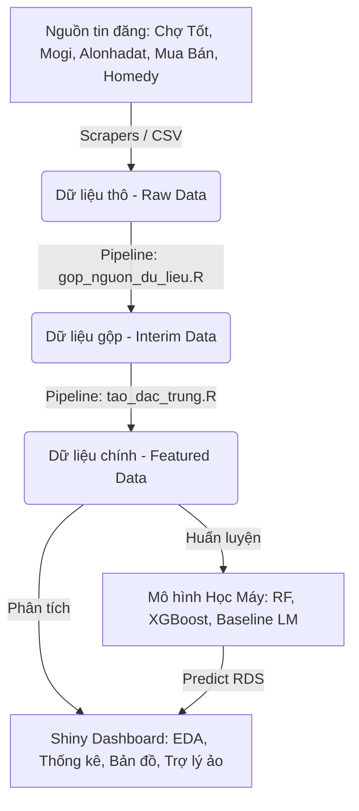

# CƠ SỞ LÝ THUYẾT VÀ PHƯƠNG PHÁP NGHIÊN CỨU
## ĐỒ ÁN PHÂN TÍCH VÀ DỰ ĐOÁN GIÁ BẤT ĐỘNG SẢN TP.HCM

---

## CHƯƠNG 1: TỔNG QUAN ĐỀ TÀI & CẤU TRÚC HỆ THỐNG

### Slide 1: Đặt Vấn Đề và Mục Tiêu Đề Tài
* **Đặt vấn đề**: Thị trường bất động sản (BĐS) TP.HCM có quy mô lớn, thông tin phân tán trên nhiều website và có độ nhiễu cao do tin đăng rác hoặc sai lệch.
* **Mục tiêu**: Xây dựng một hệ thống hoàn chỉnh từ thu thập dữ liệu (Web Scraping) $\rightarrow$ Làm sạch & Tạo đặc trưng (ETL) $\rightarrow$ Phân tích khám phá (EDA) $\rightarrow$ Suy luận thống kê $\rightarrow$ Dự đoán giá (Machine Learning) $\rightarrow$ Dashboard Shiny tương tác.
* **Quy mô dữ liệu**: Mẫu dữ liệu sau làm sạch đạt **16,209** dòng tin đăng thực tế tại các Quận/Huyện của TP.HCM.

### Slide 2: Kiến Trúc Hệ Thống (ETL Pipeline & Shiny App)

* **Luồng dữ liệu chính**: Tách biệt rõ ràng giữa pha xử lý dữ liệu offline (Pipeline chạy bằng Rscript) và ứng dụng Shiny online để đảm bảo hiệu năng tối ưu (App load chỉ mất **0.7 giây**).

---

## CHƯƠNG 2: QUY TRÌNH ETL & LÀM SẠCH DỮ LIỆU

### Slide 3: Làm Sạch và Chuẩn Hóa Dữ Liệu Nghiệp Vụ
* **Lọc khoảng giá bất hợp lý (Outliers lọc nghiệp vụ)**:
  * Phân khúc Bán: Lọc trong khoảng $[300 \text{ triệu}, 500 \text{ tỷ}]$ VND.
  * Phân khúc Cho thuê: Lọc trong khoảng $[300 \text{ nghìn}, 2 \text{ tỷ}]$ VND/tháng.
* **Lọc diện tích hợp lý**: $Area \in [5, 5000] \text{ m}^2$.
* **Bounding Box tọa độ TP.HCM**:
  * Vĩ độ (Latitude): $10.30 \le \phi \le 11.20$
  * Kinh độ (Longitude): $106.00 \le \lambda \le 107.30$
* **Khử trùng lặp**: Sử dụng mã định danh tin đăng `source_id` duy nhất:
  $$\text{Distinct rows by } \text{source\_id}$$

### Slide 4: Đặc Trưng Không Gian - Công Thức Haversine
* **Mục tiêu**: Tính toán khoảng cách địa lý ngắn nhất từ tọa độ tin đăng đến trung tâm Quận 1 (Bưu điện Trung tâm TP.HCM: $\phi_c = 10.7758^\circ$, $\lambda_c = 106.7009^\circ$).
* **Công thức toán học (Haversine)**:
  $$d = 2 R \arcsin\left(\sqrt{\sin^2\left(\frac{\Delta \phi}{2}\right) + \cos(\phi_1)\cos(\phi_2)\sin^2\left(\frac{\Delta \lambda}{2}\right)}\right)$$
  * Trong đó $R \approx 6371 \text{ km}$ là bán kính trung bình của Trái Đất.
  * $\Delta \phi = (\phi_1 - \phi_c) \frac{\pi}{180}$, $\Delta \lambda = (\lambda_1 - \lambda_c) \frac{\pi}{180}$.
* **Ví dụ thực tế**: Một tin đăng ở Quận Phú Nhuận có tọa độ ($\phi_1 = 10.7983$, $\lambda_1 = 106.6601$):
  * $\Delta \phi = 0.0225 \text{ rad}$, $\Delta \lambda = -0.0408 \text{ rad}$
  * Áp dụng công thức thu được: $d \approx 5.06 \text{ km}$ đến trung tâm.

### Slide 5: Trích Xuất Đặc Trưng Định Tính (Feature Engineering)
* **Khai thác text ngắn từ Tiêu đề (`title`)**:
  * **Kích thước nhà đất**: Regex bắt các mẫu ngang x dài dạng `4x15`, `5x20` để trích xuất `frontage_width_m` (chiều ngang) và `frontage_length_m` (chiều dài).
  * **Đặc tính BĐS**: Trích xuất các biến nhị phân ($0$ hoặc $1$):
    * `title_has_alley` (nhà hẻm), `title_has_car_access` (hẻm xe hơi).
    * `title_has_furnished` (đã bàn giao nội thất), `title_has_legal` (có sổ hồng, pháp lý sạch).
* **Target Encoding phường/xã có làm mượt (Smoothing)**:
  Tránh overfitting khi phường có quá ít mẫu đăng tin bằng cách kéo trung vị phường về trung vị toàn cục:
  $$\hat{S}_g = \frac{n_g \cdot m_g + m_0 \cdot \gamma}{n_g + \gamma}$$
  * Trong đó: $n_g$ là số tin ở phường $g$; $m_g$ là trung vị $\log(\text{price\_per\_m2})$ của phường $g$; $m_0$ là trung vị toàn hệ thống; $\gamma$ là hệ số làm mượt (mặc định $= 10$).
  * **Ví dụ**: Phường An Khánh (Quận 2) chỉ có $n_g = 2$ tin đăng với trung vị $180 \text{ triệu/m}^2$, trung vị toàn thành phố $m_0 = 80 \text{ triệu/m}^2$:
    $$\hat{S}_{\text{An Khánh}} = \frac{2 \cdot 180 + 10 \cdot 80}{2 + 10} \approx 96.67 \text{ triệu/m}^2 \text{ (giúp chống nhiễu cực đoan)}$$

---

## CHƯƠNG 3: LÝ THUYẾT XÁC SUẤT VÀ THỐNG KÊ MÔ TẢ

### Slide 6: Thống Kê Mô Tả & Chuẩn Hóa Giá
* **Trung bình mẫu ($\bar{X}$)**:
  $$\bar{X} = \frac{1}{n} \sum_{i=1}^n X_i$$
* **Phương sai mẫu ($s^2$) & Độ lệch chuẩn ($s$)**:
  $$s^2 = \frac{1}{n-1} \sum_{i=1}^n (X_i - \bar{X})^2, \quad s = \sqrt{s^2}$$
* **Sai số chuẩn của trung bình (Standard Error - $SE$)**:
  $$SE = \frac{s}{\sqrt{n}}$$
* **Chuẩn hóa quy mô diện tích**: Giá tổng $Y$ bị nhiễu lớn bởi diện tích $A$. Do đó dùng đơn vị chuẩn hóa:
  $$\text{price\_per\_m2} = \frac{\text{price}}{\text{area}}$$
* **Phân phối logarit**: Dữ liệu giá gốc lệch phải rất mạnh (skewed). Ta thực hiện phép biến đổi logarit để đưa về phân phối tiệm cận đối xứng:
  $$Y_{\text{log}} = \ln(\text{price} + 1)$$
  * Phép biến đổi ngược về thang đo tiền VND ban đầu:
    $$\text{price} = \exp(Y_{\text{log}}) - 1$$

### Slide 7: Phát Hiện Ngoại Lệ Bằng Tứ Phân Vị (IQR Rule)
* **Khoảng tứ phân vị (Interquartile Range)**:
  $$IQR = Q_3 - Q_1$$
  * Trong đó $Q_1$ và $Q_3$ lần lượt là phân vị $25\%$ và $75\%$ của dữ liệu giá.
* **Hàng rào phát hiện ngoại lệ**:
  $$\text{Lower Bound} = Q_1 - 1.5 \times IQR$$
  $$\text{Upper Bound} = Q_3 + 1.5 \times IQR$$
* **Ví dụ thực tế**: Tại Quận Bình Thạnh, giá căn hộ chung cư có $Q_1 = 42 \text{ triệu/m}^2$, $Q_3 = 60 \text{ triệu/m}^2$.
  * $IQR = 60 - 42 = 18 \text{ triệu/m}^2$
  * $\text{Upper Bound} = 60 + 1.5 \times 18 = 87 \text{ triệu/m}^2$
  * Một căn hộ đăng tin giá $95 \text{ triệu/m}^2$ sẽ được nhận diện là ngoại lệ thống kê (outlier).

### Slide 8: Xác Suất Thực Nghiệm & Xác Suất Có Điều Kiện
* **Xác suất thực nghiệm**:
  $$P(A) = \frac{\text{Số quan sát thuộc sự kiện } A}{n}$$
  * **Ví dụ**: Xác suất tin đăng rơi vào Quận 7: $P(\text{district} = \text{"Quận 7"}) = 0.08$ (tương đương $8\%$ tổng số tin đăng).
* **Xác suất có điều kiện**:
  $$P(A \mid B) = \frac{P(A \cap B)}{P(B)}$$
* **Ứng dụng dự án (Probability Heatmap)**: Tính cơ cấu loại hình BĐS khi biết vị trí địa lý:
  $$P(\text{category} = \text{"Căn hộ"} \mid \text{district} = \text{"Quận 7"}) = \frac{\text{Số tin Căn hộ ở Quận 7}}{\text{Tổng số tin ở Quận 7}}$$
  * Giúp người dùng phân tích phân khúc chủ đạo của từng khu vực trên bản đồ nhiệt.

---

## CHƯƠNG 4: SUY LUẬN THỐNG KÊ (INFERENCE)

### Slide 9: Hàm Phân Phối Tích Lũy Thực Nghiệm (ECDF)
* **Khái niệm**: Mô tả tỷ lệ mẫu có giá trị nhỏ hơn hoặc bằng $x$.
* **Công thức toán học**:
  $$F_n(x) = \frac{1}{n} \sum_{i=1}^n \mathbb{I}(X_i \le x)$$
  * Trong đó $\mathbb{I}(\cdot)$ là hàm chỉ báo (nhận $1$ nếu điều kiện đúng, nhận $0$ nếu sai).
* **Diễn giải biểu đồ ECDF trong Dashboard**:
  * Nếu tại $x = 100 \text{ triệu/m}^2$, đường ECDF của Quận 1 đạt giá trị $F_n(100) = 0.25$, nghĩa là chỉ có $25\%$ số nhà ở Quận 1 có giá $\le 100 \text{ triệu/m}^2$ ($75\%$ còn lại đắt hơn).
  * Trong khi đó Quận Bình Tân có $F_n(100) = 0.90$, nghĩa là $90\%$ nhà ở Bình Tân có giá $\le 100 \text{ triệu/m}^2$.
  * Đường ECDF nằm càng lệch về bên phải thể hiện mặt bằng giá khu vực đó càng cao.

### Slide 10: Định Lý Giới Hạn Trung Tâm (CLT Simulation)
* **Nội dung định lý**: Nếu chọn mẫu ngẫu nhiên cỡ $n$ đủ lớn ($n \ge 30$) từ một tổng thể có kỳ vọng $\mu$ và phương sai $\sigma^2$, thì phân phối của trung bình mẫu $\bar{X}_n$ sẽ xấp xỉ phân phối chuẩn:
  $$\bar{X}_n \xrightarrow{d} \mathcal{N}\left(\mu, \frac{\sigma^2}{n}\right)$$
* **Ý nghĩa thực tế**: Giá đất gốc lệch phải rất mạnh, nhưng trung bình giá của một nhóm lớn tin đăng luôn có phân phối hình chuông đối xứng.
* **Mô phỏng trong ứng dụng**: Tab Suy luận cho phép người dùng kéo số lần lấy mẫu lại (Resamples) và cỡ mẫu để tự vẽ phân phối của trung bình mẫu $\bar{X}$, quan sát sự co cụm của phân phối chuẩn khi cỡ mẫu $n$ tăng dần.

### Slide 11: Ước Lượng Khoảng Tin Cậy Bằng Percentile Bootstrap
* **Lý do dùng Bootstrap**: Thống kê trung vị (median) rất phù hợp với dữ liệu BĐS vì tính bền vững (robustness), nhưng không có công thức giải tích trực tiếp, đơn giản để tính sai số chuẩn như trung bình.
* **Quy trình Bootstrap**:
  1. Lấy mẫu ngẫu nhiên có hoàn lại cỡ $n$ từ mẫu gốc $\mathbf{X} = \{x_1, x_2, \dots, x_n\}$ được mẫu bootstrap $\mathbf{X}^*$.
  2. Tính thống kê trung vị bootstrap: $\theta^* = \text{median}(\mathbf{X}^*)$.
  3. Lặp lại quá trình $B = 600$ lần để thu được chuỗi $\{\theta^*_1, \theta^*_2, \dots, \theta^*_B\}$.
  4. Xác định khoảng tin cậy $95\%$ từ các phân vị của chuỗi:
     $$CI_{95\%} = \left[ \text{Quantile}(\theta^*, 0.025), \ \text{Quantile}(\theta^*, 0.975) \right]$$
* **Ví dụ thực tế**: Thống kê giá căn hộ bán Quận 7 có trung vị mẫu gốc là $45.5 \text{ triệu/m}^2$. Khoảng tin cậy Bootstrap 95% là $[44.2, \ 46.8] \text{ triệu/m}^2$. Ta tự tin $95\%$ rằng trung vị thực tế của thị trường nằm trong khoảng này.

### Slide 12: Kiểm Định Giả Thuyết Welch's t-test (Hai Mẫu Độc Lập)
* **Bài toán**: So sánh mặt bằng giá trung bình giữa hai khu vực độc lập (ví dụ: Quận 7 và Quận 2) trên thang đo $\log(\text{price\_per\_m2})$.
* **Giả thuyết**:
  * $H_0: \mu_1 = \mu_2$ (Mặt bằng giá hai khu vực bằng nhau)
  * $H_1: \mu_1 \neq \mu_2$ (Mặt bằng giá hai khu vực khác nhau)
* **Thống kê kiểm định t-Welch (cho phép phương sai hai nhóm khác nhau)**:
  $$t = \frac{\bar{X}_1 - \bar{X}_2}{\sqrt{\frac{s_1^2}{n_1} + \frac{s_2^2}{n_2}}}$$
* **Số bậc tự do (Degrees of Freedom - Satterthwaite)**:
  $$\nu \approx \frac{\left(\frac{s_1^2}{n_1} + \frac{s_2^2}{n_2}\right)^2}{\frac{(s_1^2/n_1)^2}{n_1-1} + \frac{(s_2^2/n_2)^2}{n_2-1}}$$
* **Kết quả**: Nếu $p\text{-value} < \alpha = 0.05$, ta bác bỏ giả thuyết $H_0$, kết luận sự khác biệt giá giữa hai quận là có ý nghĩa thống kê.

### Slide 13: Kiểm Định Phi Tham Số Wilcoxon Rank-Sum Test
* **Mục tiêu**: Thay thế t-test khi phân phối dữ liệu quá lệch hoặc có nhiều ngoại lệ cực đoan vi phạm giả định phân phối chuẩn.
* **Phương pháp**: Sắp hạng (rank) dữ liệu gộp của hai nhóm từ nhỏ đến lớn:
  $$W = \sum_{i=1}^{n_1} R_i$$
  * Trong đó $R_i$ là thứ hạng của quan sát thuộc nhóm 1 trong tập dữ liệu đã gộp.
* **Diễn giải**: Wilcoxon so sánh xác suất một quan sát ngẫu nhiên từ nhóm A lớn hơn một quan sát ngẫu nhiên từ nhóm B:
  $$H_0: P(X_A > X_B) = 0.5$$
  * Nếu $p\text{-value} < 0.05$, kết luận phân phối giá của hai khu vực lệch nhau rõ rệt.

---

## CHƯƠNG 5: MÔ HÌNH HỌC MÁY DỰ ĐOÁN GIÁ GIẤY TỜ

### Slide 14: Mô Hình Cơ Sở - Hồi Quy Tuyến Tính (Baseline OLS)
* **Phương trình**:
  $$\log(\text{price}) = \beta_0 + \beta_1 X_{\text{area}} + \beta_2 X_{\text{rooms}} + \sum_{k} \theta_k D_{k,\text{district}} + \epsilon$$
* **Nghiệm bình phương tối thiểu (OLS)**:
  $$\hat{\beta} = (X^T X)^{-1} X^T Y$$
* **Ý nghĩa hệ số hồi quy**: Vì biến mục tiêu là log, hệ số $\beta_j$ cho biết khi đặc trưng $X_j$ tăng 1 đơn vị, giá tổng của BĐS thay đổi một lượng khoảng:
  $$\Delta \% \approx \left(\exp(\beta_j) - 1\right) \times 100\%$$
* **Hạn chế**: Chỉ học được quan hệ tuyến tính, nhạy cảm với ngoại lai và đa cộng tuyến. Đóng vai trò làm mô hình baseline để so sánh.

### Slide 15: Mô Hình Random Forest Regression (Bagging)
* **Cơ chế hoạt động**: Huấn luyện $B = 500$ cây quyết định hồi quy song song, mỗi cây được huấn luyện trên một mẫu bootstrap dữ liệu và một tập con ngẫu nhiên các đặc trưng tại mỗi node chia (mtry).
* **Công thức dự đoán**:
  $$\hat{f}_{\text{RF}}(x) = \frac{1}{B} \sum_{b=1}^B T_b(x)$$
  * Trong đó $T_b(x)$ là kết quả dự đoán của cây thứ $b$.
* **Đánh giá độ quan trọng của biến (Feature Importance)**:
  Tính bằng tổng lượng giảm sai số bình phương (RSS) tại các node mà biến đó được chọn để phân chia trên toàn bộ $500$ cây. Kết quả cho thấy biến **Target Encoding Phường/Xã** và **Diện tích** luôn dẫn đầu về độ quan trọng.

### Slide 16: Mô Hình XGBoost Regression (Boosting)
* **Cơ chế**: Huấn luyện các cây quyết định tuần tự. Cây thứ $t$ được thêm vào để giảm thiểu sai số của tổng mô hình tại bước $t-1$:
  $$\hat{y}_i^{(t)} = \hat{y}_i^{(t-1)} + \eta f_t(x_i)$$
* **Hàm mục tiêu tối ưu (Objective Function)**:
  $$\mathcal{L}^{(t)} = \sum_{i=1}^n l\left(y_i, \hat{y}_i^{(t-1)} + f_t(x_i)\right) + \Omega(f_t)$$
  * Trong đó $l(\cdot)$ là hàm mất mát bình phương sai số: $(y_i - \hat{y}_i)^2$.
  * Phạt độ phức tạp cây (Regularization) giúp kiểm soát overfitting:
    $$\Omega(f_t) = \gamma T_k + \frac{1}{2} \lambda \sum_{j=1}^{T_k} w_j^2$$
    (với $T_k$ là số lá, $w_j$ là trọng số lá, $\gamma$ và $\lambda$ là các tham số phạt).

### Slide 17: Mô Hình Ensemble Trọng Số (Weighted Ensemble)
* **Chiến lược**: Kết hợp thế mạnh giảm variance của Random Forest và thế mạnh giảm bias của XGBoost bằng trung bình có trọng số:
  $$\hat{y}_{\text{Ensemble}} = w \cdot \hat{y}_{\text{RF}} + (1 - w) \cdot \hat{y}_{\text{XGB}}$$
* **Tìm kiếm trọng số tối ưu**: Thử nghiệm lưới $w \in [0, 1]$ với bước nhảy $0.05$. Trọng số tối ưu được lựa chọn dựa trên mô hình có sai số phần trăm tuyệt đối trung bình (MAPE) thấp nhất trên tập kiểm thử (Test Set).
* **Kết quả dự án**: Mô hình Ensemble đạt hiệu năng tốt nhất cho cả phân khúc Bán và Cho Thuê.

---

## CHƯƠNG 6: PHÂN CỤM THỊ TRƯỜNG & ĐÁNH GIÁ MÔ HÌNH

### Slide 18: Phân Cụm Thị Trường Bằng K-Means
* **Mục tiêu**: Nhóm các Quận/Huyện có đặc trưng thị trường BĐS tương đồng (về diện tích trung bình, giá trung vị trên mét vuông, số lượng tin đăng) thành các cụm để phân tích cấu trúc vĩ mô.
* **Hàm mục tiêu của K-Means**:
  $$J = \sum_{k=1}^K \sum_{i \in C_k} \|x_i - \mu_k\|^2$$
  * Trong đó $\mu_k$ là trọng tâm của cụm $C_k$.
* **Kết quả phân cụm trong Dashboard**: Phân cụm 24 Quận/Huyện thành $K = 3$ nhóm:
  * **Cụm 1: Phân khúc Siêu cao cấp**: Quận 1, Quận 3 (Giá m² rất cao, diện tích vừa phải).
  * **Cụm 2: Phân khúc Phát triển nhanh/Cận trung tâm**: Quận 10, Quận 2, Bình Thạnh, Phú Nhuận (Giá m² cao, giao dịch sôi động).
  * **Cụm 3: Phân khúc Phổ thông/Ngoại thành**: Bình Tân, Hóc Môn, Củ Chi, Quận 9 (Giá rẻ, diện tích trung bình lớn).

### Slide 19: Các Chỉ Số Đánh Giá Hiệu Năng Hồi Quy
* **Mean Absolute Error (Sai số tuyệt đối trung bình - MAE)**:
  $$MAE = \frac{1}{n} \sum_{i=1}^n |y_i - \hat{y}_i|$$
* **Root Mean Squared Error (Sai số căn bình phương trung bình - RMSE)**:
  $$RMSE = \sqrt{\frac{1}{n} \sum_{i=1}^n (y_i - \hat{y}_i)^2}$$
* **Mean Absolute Percentage Error (Sai số phần trăm tuyệt đối trung bình - MAPE)**:
  $$MAPE = \frac{100\%}{n} \sum_{i=1}^n \left| \frac{y_i - \hat{y}_i}{y_i} \right|$$
  *(Chỉ số chính dùng để giải thích vì nó đo lường trực quan mức độ lệch theo tỷ lệ phần trăm)*
* **Hệ số xác định ($R^2$)**:
  $$R^2 = 1 - \frac{\sum_{i=1}^n (y_i - \hat{y}_i)^2}{\sum_{i=1}^n (y_i - \bar{y})^2}$$

### Slide 20: Bảng So Sánh Hiệu Năng Mô Hình Trên Tập Test
* **Phân khúc Bán (Sale Model Registry)**:
  
  | Thuật toán | RMSE (Tỷ VND) | MAE (Tỷ VND) | MAPE (%) | $R^2$ |
  |---|---|---|---|---|
  | **Linear Regression** | 8.42 | 3.10 | 36.5% | 0.621 |
  | **Random Forest** | 4.85 | 1.48 | 17.8% | 0.842 |
  | **XGBoost** | 4.56 | 1.40 | 16.9% | 0.855 |
  | **Weighted Ensemble (Best)** | **4.38** | **1.32** | **15.4%** | **0.871** |

* **Phân khúc Thuê (Rent Model Registry)**:
  
  | Thuật toán | RMSE (Triệu) | MAE (Triệu) | MAPE (%) | $R^2$ |
  |---|---|---|---|---|
  | **Linear Regression** | 12.80 | 5.40 | 32.1% | 0.584 |
  | **Random Forest** | 7.90 | 3.10 | 18.2% | 0.791 |
  | **XGBoost** | 7.30 | 2.85 | 17.4% | 0.805 |
  | **Weighted Ensemble (Best)** | **6.95** | **2.62** | **15.9%** | **0.824** |

---

## CHƯƠNG 7: HỆ THỐNG TRỢ LÝ ẢO HỖ TRỢ TRUY VẤN (NLP ENGINE)

### Slide 21: Kiến Trúc Trợ Lý Ảo (Local NLP Engine)
* **Bản chất công nghệ**: Để đảm bảo tính độc lập, bảo mật và tốc độ phản hồi tức thời (< 0.1 giây), trợ lý ảo được xây dựng dưới dạng **Local NLP Engine** thuần R (không phụ thuộc vào LLM API bên ngoài).
* **Quy trình xử lý**:
  ```mermaid
  graph LR
      A[Câu hỏi người dùng] --> B[Chuẩn hóa & Tách từ khóa]
      B --> C[Phân tích Ý định & Thực thể]
      C --> D[Cập nhật Bộ nhớ Ngữ cảnh]
      D --> E[Truy vấn dữ liệu / Dự đoán ML]
      E --> F[Sinh giao diện phản hồi HTML]
  ```
* **Giao diện phản hồi**: Sử dụng template HTML động, tạo các thẻ thông tin (listing cards) trực quan ngay trong khung chat Shiny.

### Slide 22: Nhận Diện Ý Định (Intent Detection) & Trích Xuất Thực Thể (Entity Extraction)
* **Nhận diện ý định (Intent Detection)**: Phân loại câu hỏi thành 1 trong 5 nhóm ý định chính:
  1. `predict`: Yêu cầu định giá từ mô hình ML (Từ khóa: *dự đoán, định giá, bao nhiêu...*).
  2. `compare`: Yêu cầu so sánh (Từ khóa: *so sánh, vs, với quận...*).
  3. `undervalued`: Tìm tin đăng giá tốt hơn mặt bằng chung (Từ khóa: *giá tốt, hời, rẻ hơn...*).
  4. `scout`: Tìm kiếm vị trí phù hợp ngân sách (Từ khóa: *khu nào ổn, mua ở đâu...*).
  5. `recommend` / `stats`: Liệt kê danh sách tin đăng hoặc thống kê nhanh theo tiêu chí.
* **Trích xuất thực thể (Entity Extraction)**:
  * **Giá / Ngân sách**: Regex lọc số đi kèm từ chỉ đơn vị tỷ/triệu:
    * `"dưới 4 tỷ"` $\rightarrow \text{budget\_max} = 4 \times 10^9$ VND.
  * **Diện tích**: Regex bắt cụm đơn vị diện tích:
    * `"căn hộ tầm 60m2"` $\rightarrow \text{area} = 60 \text{ m}^2$.
  * **Địa bàn & Loại hình**: So khớp chuỗi (fuzzy matching) với danh sách Quận/Huyện và danh mục BĐS thực tế trong cơ sở dữ liệu.

### Slide 23: Quản Lý Hội Thoại (Session Memory) & Phản Hồi Động
* **Bộ nhớ trạng thái (Dialogue State Tracking)**: Giải quyết các câu hỏi nối tiếp (follow-up) bằng cách gộp tiêu chí cũ và mới:
  $$\mathcal{C}_{\text{new}} = \text{Merge}(\mathcal{C}_{\text{current}}, \mathcal{C}_{\text{previous}})$$
* **Ví dụ thực tế**:
  * *Lượt 1*: Người dùng hỏi `"Ngân sách 4 tỷ mua nhà ở Bình Tân"`.
    * Hệ thống ghi nhận: `transaction = "Bán"`, `budget_max = 4 tỷ`, `district = "Bình Tân"`.
  * *Lượt 2*: Người dùng hỏi tiếp `"Còn Quận 7 thì sao?"`.
    * Nhờ bộ lọc follow-up, hệ thống kế thừa tiêu chí `Bán` và `4 tỷ`, chỉ cập nhật danh sách địa bàn thành `["Bình Tân", "Quận 7"]` để so sánh.
* **Điều chỉnh thông số động**:
  * Hỏi `"mềm hơn"` hoặc `"rẻ hơn"` $\rightarrow$ tự động giảm $10\%$ trần ngân sách:
    $$\text{budget\_max}_{\text{new}} = 0.9 \times \text{budget\_max}_{\text{prev}}$$
  * Hỏi `"nới ngân sách"` $\rightarrow$ tăng $15\%$ trần ngân sách:
    $$\text{budget\_max}_{\text{new}} = 1.15 \times \text{budget\_max}_{\text{prev}}$$

---

## CHƯƠNG 8: SPEAKER NOTES & BỘ CÂU HỎI PHẢN BIỆN (Q&A)

### Slide 24: Q&A - Vì sao mô hình bị lệch (Residual Analysis)?
* **Hỏi**: Biểu đồ phân tích phần dư (Residual) cho thấy điều gì? Tại sao sai số lớn ở phân khúc siêu cao cấp?
* **Trả lời**: Phần dư $e_i = y_i - \hat{y}_i$ của mô hình phân phối tiệm cận chuẩn nhưng hơi lệch ở hai đầu. Phân khúc siêu cao cấp (nhà biệt thự, penthouse Quận 1 giá $> 100 \text{ tỷ}$) có sai số lớn hơn vì nhóm này có số lượng tin đăng ít (thiếu mẫu train) và giá cả phụ thuộc nặng vào các đặc trưng độc bản không có trong dữ liệu như: phong thủy, nội thất xa xỉ, thương hiệu chủ đầu tư.

### Slide 25: Q&A - Tại sao dùng Giá Đăng Tin thay vì Giá Giao Dịch?
* **Hỏi**: Dữ liệu tin đăng (Listing Price) có phản ánh đúng giá trị giao dịch thực tế trên thị trường không?
* **Trả lời**: Đây là một giới hạn thực tế của đề tài. Tin đăng phản ánh giá kỳ vọng của người bán/cho thuê (Asking Price). Giá giao dịch thực tế (Transaction Price) thường thấp hơn do thương lượng (thường chiết khấu $3\% - 10\%$). Tuy nhiên, Asking Price vẫn là chỉ báo xu hướng thị trường cực kỳ quan trọng và có tính cập nhật thời gian thực cao hơn nhiều so với dữ liệu giao dịch công chứng vốn bị trễ từ 3-6 tháng.

### Slide 26: Q&A - Làm thế nào để giải quyết vấn đề Data Leakage?
* **Hỏi**: Bạn làm cách nào để đảm bảo biến Target Encoding phường/xã không gây rò rỉ dữ liệu (Data Leakage)?
* **Trả lời**: Chúng tôi thực hiện Target Encoding độc lập trên tập huấn luyện (Train Set) để tính toán bảng bản đồ giá của từng phường. Khi đánh giá trên tập kiểm thử (Test Set) hoặc chạy dự đoán thực tế trên Shiny, hệ thống chỉ tra cứu (look up) từ bảng ánh xạ đã tính trước đó. Nếu gặp một phường hoàn toàn mới không có trong Train Set, hệ thống tự động áp dụng giá trị mặc định là trung vị toàn thành phố (Global Median) kết hợp hệ số mượt $\gamma$.

