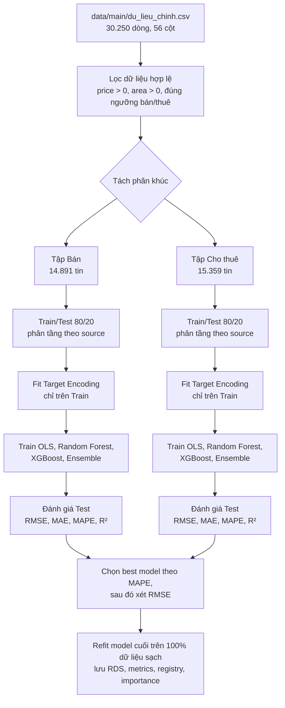
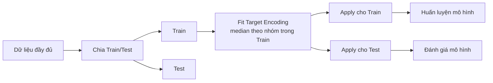
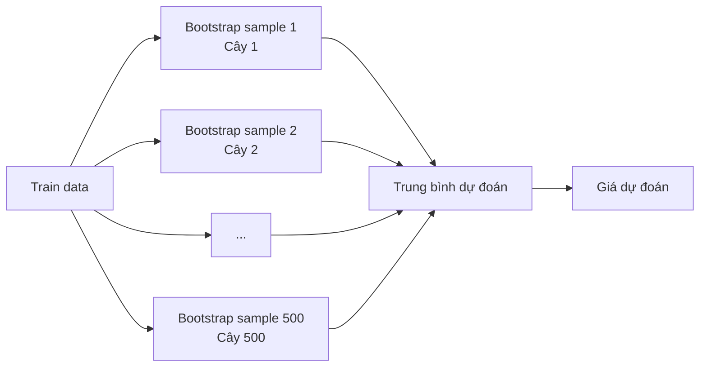
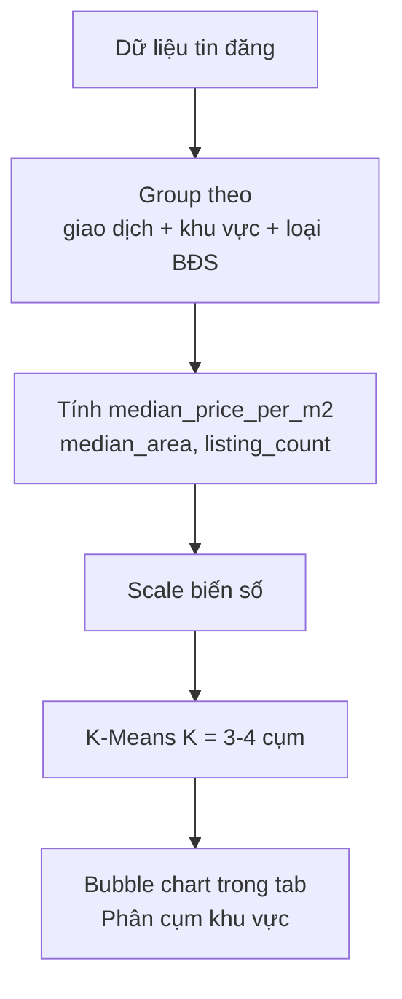
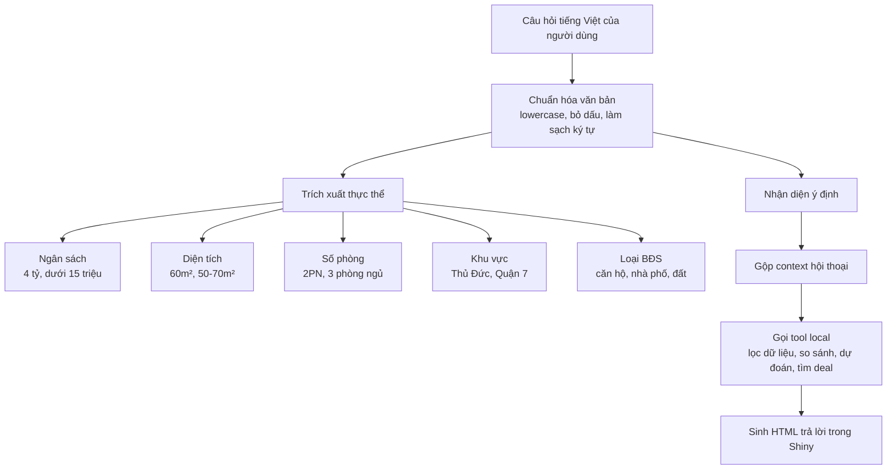
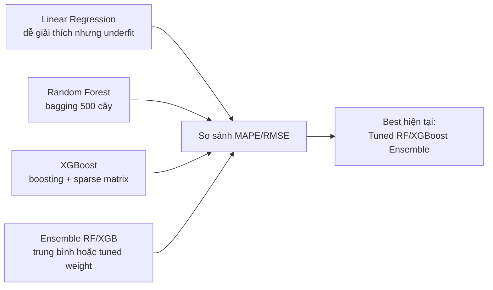

# BAO CAO CO SO LY THUYET VA PHUONG PHAP NGHIEN CUU
## De tai: Xay dung he thong thu thap, phan tich va du doan gia bat dong san TP.HCM bang R/Shiny

> Tai lieu nay duoc viet theo dan y trong `docs/references/do_an_ket_thuc_mon_hoc_R.pdf` gom 11 phan: Tom tat, Gioi thieu, Du lieu, Truc quan hoa du lieu, Mo hinh hoa du lieu, Thuc nghiem - ket qua - thao luan, Ket luan, Phu luc, Dong gop, Tham khao va Peer assessment. Noi dung ben duoi tong hop toan bo nhung thanh phan dang co trong du an `phantichnhadathcm`, uu tien so lieu thuc te doc tu CSV/model artifact hien tai.

---

## 1. TOM TAT (ABSTRACT)

Do an xay dung mot he thong phan tich bat dong san TP.HCM bang ngon ngu R, ket hop ba lop cong viec chinh: thu thap va chuan hoa du lieu tin dang tu nhieu nguon, phan tich truc quan va suy luan thong ke, sau do huan luyen mo hinh may hoc de uoc tinh gia ban/gia thue. San pham cuoi cung duoc dong goi thanh ung dung Shiny Dashboard co nhieu tab tuong tac: Tong quan, Ban do du lieu, Phan tich gia, Suy luan thong ke, Du doan gia, Danh gia model, Phan cum khu vuc, Du lieu va Tro ly BDS local.

Tap du lieu chinh dang dung trong du an la `data/main/du_lieu_chinh.csv`, gom **30,250 tin dang** va **56 cot** sau khi gop nguon, lam sach va tao dac trung. Du lieu den tu 6 nhom nguon/kenh: Mogi, Cho Tot, Alonhadat, Luachonnhadat, Homedy va Muaban; rieng Alonhadat co ca nguon crawl truc tiep va nguon CSV local duoc import lai, Mogi co them nguon crawl bo sung uu tien tin cho thue. Trong tap du lieu chinh co **14,891 tin ban** va **15,359 tin cho thue**. Gia ban trung vi toan bo phan khuc ban la khoang **6.30 ty VND**, dien tich trung vi **76 m2**, don gia trung vi **91.21 trieu VND/m2**. Gia thue trung vi la khoang **25 trieu VND/thang**, dien tich trung vi **98 m2**, don gia thue trung vi **235.00 nghin VND/m2/thang**.

Quy trinh ETL duoc chia thanh cac buoc ro rang. Cac scraper/importer trong `scripts/scrapers/` va `scripts/importers/` tao du lieu raw theo schema noi bo. Script `scripts/processing/gop_nguon_du_lieu.R` chuan hoa 27 cot chung, loc gia/dien tich bat hop ly va khu trung lap theo `source_id` va URL tin dang. Script `scripts/processing/tao_dac_trung.R` tao cac bien phuc vu thong ke va mo hinh nhu `log_price`, `log_area`, `log_price_per_m2`, `distance_to_center`, cac bien text nhan dien mat tien/hem xe hoi/phap ly/noi that, so tang/phong suy luan, tuoi tin dang va nhom gia.

Ve mo hinh hoa, do an tach rieng hai bai toan: du doan **gia ban** va du doan **gia thue**. Moi phan khuc duoc danh gia bang 5 mo hinh: Linear Regression, Random Forest, XGBoost, RF + XGBoost Ensemble trung binh 0.5 va Tuned RF/XGBoost Ensemble co trong so toi uu. Cac mo hinh duoc validate theo ti le **80/20 phan tang theo nguon du lieu** (`stratified_random_by_source`). Theo artifact hien tai trong `models/dang_ky_mo_hinh.csv`, mo hinh tot nhat cho ca hai phan khuc la **Tuned RF/XGBoost Ensemble**. Ket qua validate hien tai:

| Phan khuc | Best model | Train validate | Test validate | RMSE | MAE | MAPE | R2 |
|---|---|---:|---:|---:|---:|---:|---:|
| Ban | Tuned RF/XGBoost Ensemble | 11,911 | 2,978 | 24.16 ty VND | 6.89 ty VND | 37.84% | 0.680 |
| Cho thue | Tuned RF/XGBoost Ensemble | 12,285 | 3,074 | 84.81 trieu VND | 26.94 trieu VND | 41.21% | 0.564 |

Ket qua cho thay mo hinh cay va ensemble tot hon hoi quy tuyen tinh, nhung sai so van con lon do du lieu bat dong san rat phan tan, gia dang tin khong phai gia giao dich thuc, nhieu loai BDS co don vi gia khac nhau va mot so dac trung quan trong nhu huong nha, phap ly chi tiet, chat luong noi that, vi tri hem/duong thuc te chua duoc cau truc hoa day du.

Ngoai du bao gia, dashboard con tich hop suy luan thong ke gom xac suat thuc nghiem, xac suat co dieu kien, ECDF, mo phong Dinh ly gioi han trung tam (CLT), bootstrap khoang tin cay cho trung vi gia/m2, Welch's t-test va Wilcoxon Rank-Sum test. Tro ly BDS trong ung dung la bo may NLP local viet bang R, khong goi API ngoai; no co kha nang nhan dien y dinh, trich xuat ngan sach/dien tich/so phong/khu vuc/loai BDS, ghi nho ngu canh hoi thoai va tra ve bang/thong tin/listing cards tu du lieu that.

---

## 2. GIOI THIEU (INTRODUCTION)

### 2.1 Boi canh va ly do chon de tai

Thi truong bat dong san TP.HCM co quy mo lon, toc do bien dong cao va thong tin phan tan tren nhieu nen tang dang tin. Mot nguoi mua, nguoi thue hoac nha dau tu muon nam duoc mat bang gia can doc nhieu website, so sanh nhieu khu vuc va tu xu ly cac van de nhu tin trung lap, gia dang ao, thieu toa do, ten quan/huyen khong dong nhat, ten loai BDS khac nhau giua cac nguon. Neu chi doc tung tin rieng le, nguoi dung de bi anh huong boi cac tin gia qua cao/thap hoac bo qua xu huong chung cua thi truong.

Trong boi canh mon hoc "Lap trinh R cho phan tich", de tai nay phu hop vi khai thac duoc nhieu nhom ky thuat da hoc:

- Doc, ghi va tien xu ly du lieu bang R.
- Thu thap du lieu tu web/API.
- Lam sach du lieu, chuan hoa nhan, loc ngoai lai.
- Truc quan hoa du lieu bang ggplot2, plotly va leaflet.
- Thong ke mo ta va suy luan thong ke.
- Mo hinh hoa hoi quy va may hoc.
- Dong goi thanh ung dung phan tich tuong tac bang Shiny.

### 2.2 Van de nghien cuu

Do an tap trung tra loi cac cau hoi sau:

1. Co the tu dong thu thap va hop nhat du lieu bat dong san TP.HCM tu nhieu nguon khac nhau thanh mot schema chung hay khong?
2. Cac khu vuc nao co nhieu tin dang nhat, gia/m2 cao nhat, co cau loai BDS ra sao?
3. Gia bat dong san co moi quan he nhu the nao voi dien tich, loai BDS, khu vuc, khoang cach den trung tam, va cac dac trung van ban trong tieu de?
4. Co the uoc tinh gia ban/gia thue bang cac mo hinh hoi quy va may hoc trong R voi sai so chap nhan duoc hay khong?
5. Nhung bat dinh trong du lieu co the duoc giai thich bang thong ke suy luan nhu bootstrap, t-test, Wilcoxon va CLT nhu the nao?
6. Co the xay dung mot dashboard de nguoi dung khong can doc code van co the xem ban do, bieu do, bang du lieu, du doan gia va hoi tro ly BDS hay khong?

### 2.3 Muc tieu do an

Do an co 6 muc tieu chinh:

1. **Xay dung pipeline du lieu**: thu thap/import du lieu tu Cho Tot, Alonhadat, Luachonnhadat, Muaban, Mogi, Homedy; luu ve `data/raw`; gop thanh `data/interim/du_lieu_gop_nguon.csv`; tao du lieu chinh `data/main/du_lieu_chinh.csv`.
2. **Chuan hoa va lam sach du lieu**: dua cac nguon ve schema chung, ep kieu cot, loc gia/dien tich bat hop ly, chuan hoa quan/huyen, tinh gia/m2, khu trung lap bang id va URL.
3. **Tao dac trung phan tich**: trich dac trung tu tieu de/dia chi, tinh khoang cach Haversine den trung tam, log-transform, tao bien thoi gian, phan khuc gia, target encoding trong qua trinh train model.
4. **Phan tich truc quan va thong ke**: tao cac bieu do offline trong `plots/` va cac bieu do tuong tac trong dashboard.
5. **Huan luyen va danh gia mo hinh du doan gia**: so sanh Linear Regression, Random Forest, XGBoost va Ensemble theo RMSE, MAE, MAPE, R2.
6. **Trien khai ung dung Shiny**: giao dien loc du lieu, ban do Leaflet, du doan gia, model diagnostics, phan cum, bang du lieu va tro ly hoi dap local.

### 2.4 Pham vi nghien cuu

Pham vi khong gian la thi truong TP.HCM theo nhan quan/huyen/khu vuc cu trong du lieu dang tin. File `scripts/lib/chuan_hoa_quan_huyen.R` quy cac cach ghi khac nhau ve nhan thi truong thong nhat, vi du "Quan 2", "Quan 9", "Thu Duc" duoc quy ve **Thanh pho Thu Duc**. Script cung co mapping mot so ten phuong moi ve khu vuc thi truong cu de dashboard de doc hon. Du lieu hien tai khong con dong "Khong ro" sau buoc chuan hoa; tap du lieu van giu **2 dong "TP Vung Tau cu"**, **1 dong "TP Ben Cat cu"** va **1 dong "Binh Duong cu"** nhu canh bao nguon dang tin co the vuot ngoai pham vi TP.HCM.

Pham vi nghiep vu gom ca **ban** va **cho thue**. Hai phan khuc duoc tach rieng khi huan luyen mo hinh vi don vi gia va dong luc thi truong khac nhau. Du lieu su dung la **gia dang tin** (asking/listing price), khong phai gia giao dich da cong chung, nen ket qua duoc hieu la mat bang rao ban/rao thue tren cac nen tang, khong phai gia chot cuoi cung.

### 2.5 Cau truc du an

```text
phantichnhadathcm/
|-- app.R
|-- README.md
|-- data/
|   |-- raw/                 # Du lieu rieng tung nguon
|   |-- interim/             # Du lieu gop nguon
|   |-- main/                # Du lieu chinh cho app/model
|   `-- logs/                # Nhat ky cap nhat
|-- scripts/
|   |-- config/              # Cau hinh path dung chung
|   |-- lib/                 # Chuan hoa quan/huyen
|   |-- scrapers/            # Thu thap tu web/API
|   |-- importers/           # Nhap CSV local ve schema chung
|   |-- processing/          # Gop nguon, tao dac trung
|   |-- analysis/            # EDA/plots
|   |-- models/              # Huan luyen model
|   |-- pipeline/            # Chay pipeline/cap nhat tu dong
|   `-- checks/              # Kiem tra nhanh app/model/tro ly
|-- ung_dung/
|   |-- ham_ho_tro_ung_dung.R
|   |-- giao_dien_ung_dung.R
|   `-- may_chu_ung_dung.R
|-- models/
|-- plots/
|-- docs/
|   |-- co_so_ly_thuyet.md
|   |-- references/
|   `-- diagrams/
`-- www/
    |-- giao_dien.css
    |-- tuong_tac.js
    `-- hcmute-logo.png
```

### 2.6 Vai tro cac file chinh

| File/thu muc | Vai tro |
|---|---|
| `app.R` | Diem vao ung dung Shiny, nap package, cau hinh port/host, source UI/server/helper. |
| `scripts/config/duong_dan_du_an.R` | Khai bao tat ca duong dan du lieu, model, plot, scraper, importer, pipeline. |
| `scripts/lib/chuan_hoa_quan_huyen.R` | Chuan hoa ten quan/huyen, bo dau tieng Viet, map ten phuong moi/nhan cu. |
| `scripts/processing/gop_nguon_du_lieu.R` | Doc raw CSV, dua ve 27 cot chung, loc ngoai lai, khu trung lap, luu interim. |
| `scripts/processing/tao_dac_trung.R` | Tao dac trung tu du lieu gop, tinh log, gia/m2, Haversine, text flags, thoi gian. |
| `scripts/analysis/phan_tich_eda.R` | Tao 8 bieu do EDA PNG va file `plots/tom_tat_eda_hcm.csv`. |
| `scripts/models/huan_luyen_mo_hinh.R` | Train/evaluate Linear, RF, XGBoost, Ensemble, K-Means, luu model/metrics. |
| `ung_dung/giao_dien_ung_dung.R` | Khai bao layout Shiny, sidebar, topbar, tabs, input/output placeholder. |
| `ung_dung/may_chu_ung_dung.R` | Server reactive, render plot/map/table, observeEvent, download report, chat. |
| `ung_dung/ham_ho_tro_ung_dung.R` | Ham xu ly data, format, du doan, thong ke, chart, assistant NLP, report PDF. |
| `www/giao_dien.css` | Style dashboard, KPI, panel, filter, assistant, responsive layout. |
| `www/tuong_tac.js` | Active nav, resize Plotly, auto-scroll chat, Enter de gui, STT/TTS tieng Viet. |

---

## 3. DU LIEU (DATA)

### 3.1 Nguon du lieu

Du lieu duoc thu thap/import tu cac nguon sau:

| Nguon | File dau ra chuan | Cach lay du lieu | So dong raw hien tai |
|---|---|---|---:|
| Cho Tot | `data/raw/chotot/chotot_schema_chuan.csv` | Goi API JSON `gateway.chotot.com`, co cache SQLite | 8,112 |
| Alonhadat crawler | `data/raw/alonhadat/alonhadat_schema_chuan.csv` | Crawl HTML bang `httr`, `rvest`, `xml2` | 62 |
| Alonhadat local | `data/raw/alonhadat/alonhadat_local_schema_chuan.csv` | Import CSV local `alonhadat_local_nguon.csv` | 1,279 |
| Luachonnhadat | `data/raw/luachonnhadat/luachonnhadat_schema_chuan.csv` | Goi API loadmore, co tuy chon fetch detail | 799 |
| Muaban | `data/raw/muaban/muaban_schema_chuan.csv` | Crawl HTML, co fallback Chrome headless neu co `chromote` | 363 |
| Mogi | `data/raw/mogi/mogi_schema_chuan.csv` | Import CSV sach/goc, CSV bo sung va CSV crawl Mogi | 19,073 |
| Homedy | `data/raw/homedy/homedy_schema_chuan.csv` | Import CSV sach/goc | 566 |
| Gop nguon | `data/interim/du_lieu_gop_nguon.csv` | Ket qua hop nhat raw | 30,250 |

Tong raw theo cac file chuan la 30,254 dong, sau loc/khu trung lap con 30,250 dong trong file interim va file main. Su khac biet 4 dong den tu viec loai trung lap hoac dong khong hop le khi gop nguon.

### 3.2 Cau hinh duong dan du lieu

Tat ca duong dan duoc tap trung trong `scripts/config/duong_dan_du_an.R`. Cach thiet ke nay giup:

- Tranh hard-code duong dan o nhieu file.
- Khi doi ten/vi tri file chi can sua mot noi.
- App, pipeline, check script va model dung chung cung mot nguon cau hinh.
- Co the mo rong nguon du lieu bang cach bo sung path moi vao `PATHS`.

Mot so path quan trong:

```r
PATHS$combined_raw_csv = "data/interim/du_lieu_gop_nguon.csv"
PATHS$featured_csv     = "data/main/du_lieu_chinh.csv"
PATHS$metrics_csv      = "models/chi_so_mo_hinh.csv"
PATHS$registry_csv     = "models/dang_ky_mo_hinh.csv"
PATHS$sale_model_rds   = "models/mo_hinh_gia_ban.rds"
PATHS$rent_model_rds   = "models/mo_hinh_gia_thue.rds"
```

So do duoi day tom tat cach du lieu va cau hinh chay duoc lien ket trong he thong:

```mermaid
flowchart LR
  subgraph Config["Cau hinh chay"]
    ENV["Bien moi truong<br/>BDS_APP_HOST<br/>BDS_APP_PORT"]
    APP_ENTRY["app.R"]
    PATH_CONFIG["scripts/config/duong_dan_du_an.R<br/>PATHS"]
    LOCAL_LIB[".local/thu_vien_r<br/>use_local_r_libs()"]
  end

  subgraph RawData["Du lieu dau vao"]
    RAW_CHOTOT["PATHS$chotot_raw_csv<br/>data/raw/chotot/chotot_schema_chuan.csv"]
    RAW_SOURCES["PATHS$source_raw_csvs<br/>Alonhadat, Luachonnhadat,<br/>Muaban, Mogi, Homedy"]
    CACHE["PATHS$chotot_sqlite<br/>data/cache/cache_chotot.sqlite"]
  end

  subgraph Processing["Xu ly du lieu"]
    MERGE["PATHS$merge_sources_script<br/>gop_nguon_du_lieu.R"]
    COMBINED["PATHS$combined_raw_csv<br/>data/interim/du_lieu_gop_nguon.csv"]
    FEATURE["PATHS$feature_engineering_script<br/>tao_dac_trung.R"]
    MAIN["PATHS$featured_csv<br/>data/main/du_lieu_chinh.csv"]
  end

  subgraph Runtime["Model va ung dung"]
    TRAIN["PATHS$train_models_script<br/>huan_luyen_mo_hinh.R"]
    MODEL_FILES["models/*.rds<br/>chi_so_mo_hinh.csv<br/>dang_ky_mo_hinh.csv"]
    SHINY["Shiny dashboard<br/>ui + server + helpers"]
  end

  ENV --> APP_ENTRY
  APP_ENTRY --> PATH_CONFIG
  APP_ENTRY --> LOCAL_LIB
  PATH_CONFIG --> RAW_CHOTOT
  PATH_CONFIG --> RAW_SOURCES
  PATH_CONFIG --> CACHE
  RAW_CHOTOT --> MERGE
  RAW_SOURCES --> MERGE
  MERGE --> COMBINED
  COMBINED --> FEATURE
  CACHE -. fallback toa do/cache .-> FEATURE
  FEATURE --> MAIN
  MAIN --> TRAIN
  TRAIN --> MODEL_FILES
  MAIN --> SHINY
  MODEL_FILES --> SHINY
  PATH_CONFIG --> SHINY
```



So do nguon cung duoc luu tai `docs/diagrams/du_lieu_va_cau_hinh_chay.mmd` de tai su dung khi render bao cao.

### 3.3 Schema du lieu chuan sau gop nguon

Script `gop_nguon_du_lieu.R` dinh nghia 27 cot chuan trong `STANDARD_COLS`:

| Nhom cot | Cot |
|---|---|
| Dinh danh nguon | `source`, `source_group`, `source_id`, `ad_id` |
| Mo ta tin dang | `title`, `price_str`, `address`, `ward`, `district_id`, `district_name`, `category_id`, `category_name` |
| Gia va dien tich | `price`, `area`, `rooms`, `price_m`, `price_per_m2` |
| Toa do/hinh/link | `lat`, `lon`, `image`, `ad_url`, `source_url`, `has_coord` |
| Thoi gian/kiem soat | `posted_at`, `scraped_at`, `page_fetched`, `is_rent` |

Nguyen tac chuan hoa:

- Nguon nao thieu cot thi them cot do voi gia tri `NA`.
- Cot chuoi ep ve character, cot so ep ve numeric, cot co/khong ep ve integer.
- Neu thieu `source_id`, he thong tao tu `source` va `ad_id`.
- Neu thieu `source_url`, dung lai `ad_url`.
- URL duoc chuan hoa bang cach trim, bo dau `/` cuoi va dua ve lowercase de phuc vu khu trung lap.

### 3.4 Quy tac lam sach va loc nghiep vu

Do du lieu tin dang thu thap tu web co nhieu ngoai lai, script gop nguon va tao dac trung ap dung cac quy tac:

| Dieu kien | Gia tri giu lai |
|---|---|
| Gia ban | Tu 300,000,000 den 500,000,000,000 VND |
| Gia thue | Tu 300,000 den 2,000,000,000 VND/thang |
| Dien tich | Tu 5 den 5,000 m2 |
| Gia tri `price` | Khong duoc `NA`, phai lon hon 0 |
| Trung lap cap 1 | `distinct(source_id, .keep_all = TRUE)` |
| Trung lap cap 2 | Chuan hoa `ad_url` thanh `ad_url_key`, sau do `distinct(ad_url_key, .keep_all = TRUE)` |

O buoc tao dac trung, toa do chi duoc giu neu nam trong bounding box mo rong cua TP.HCM:

```text
10.30 <= latitude  <= 11.20
106.00 <= longitude <= 107.30
```

Neu toa do khong hop le, cot `lat`/`lon` bi gan `NA`. Khi hien thi ban do, app uoc luong toa do bang tam quan/huyen va them jitter nho de cac marker khong chong len nhau.

### 3.5 Chuan hoa quan/huyen

File `scripts/lib/chuan_hoa_quan_huyen.R` giai quyet bai toan ten khu vuc khong dong nhat. Cac ham chinh:

- `district_strip_vietnamese()`: bo dau tieng Viet, dua ve lowercase.
- `district_missing_label()`: phat hien nhan rong/khong ro/NA/null.
- `district_clean_label()`: thay nhan thieu bang "Khong ro".
- `canonical_hcmc_district_one()`: tim quan/huyen tu current label, address, title, URL.
- `canonical_hcmc_district()`: vector hoa ham chuan hoa cho toan bo cot.

Mot so quy tac dang chu y:

- `Quan 2`, `Quan 9`, `Thu Duc`, `TP Thu Duc` duoc quy ve **Thanh pho Thu Duc**.
- Cac cach ghi `q7`, `quan 7`, `Quận 7` duoc quy ve **Quận 7**.
- Ten quan chu nhu `Binh Thanh`, `Go Vap`, `Tan Phu` duoc quy ve nhan co dau day du.
- Mot so phuong moi nam 2025 duoc gan ve khu vuc thi truong cu, giup bao cao/doc bieu do phu hop voi thoi quen thi truong.

### 3.6 Tap du lieu chinh sau feature engineering

File `data/main/du_lieu_chinh.csv` co **30,250 dong** va **56 cot**. Ngoai 27 cot schema goc, file nay co them cac cot dac trung:

| Nhom dac trung | Cot |
|---|---|
| Kich thuoc trich tu text | `frontage_width_m`, `frontage_length_m`, `frontage_ratio` |
| So tang/phong suy luan | `inferred_floors`, `inferred_rooms` |
| Bien nhi phan tu tieu de | `title_has_frontage`, `title_has_alley`, `title_has_car_access`, `title_has_corner`, `title_has_elevator`, `title_has_furnished`, `title_has_legal`, `title_has_income_info` |
| Do dai text | `title_token_count` |
| Co du lieu goc | `has_area`, `has_rooms`, `has_coord` |
| Giao dich | `transaction_type` |
| Thong ke phuong | `ward_median_price`, `ward_listing_count`, `ward_price_encoded` |
| Bien log | `log_price`, `log_area`, `log_price_per_m2` |
| Khong gian/thoi gian | `distance_to_center`, `listing_age_days`, `posted_hour`, `posted_wday`, `is_weekend_post` |
| Phan khuc gia | `price_segment` |

### 3.7 Phan bo du lieu theo nguon

| Nguon | So tin | Ty trong xap xi |
|---|---:|---:|
| Mogi | 19,073 | 63.1% |
| Cho Tot | 8,108 | 26.8% |
| Alonhadat | 1,341 | 4.4% |
| Luachonnhadat | 799 | 2.6% |
| Homedy | 566 | 1.9% |
| Muaban | 363 | 1.2% |

Theo giao dich:

| Nguon | Ban | Cho thue | Tong |
|---|---:|---:|---:|
| Alonhadat | 1,313 | 28 | 1,341 |
| Cho Tot | 8,018 | 90 | 8,108 |
| Homedy | 390 | 176 | 566 |
| Luachonnhadat | 400 | 399 | 799 |
| Mogi | 4,591 | 14,482 | 19,073 |
| Muaban | 179 | 184 | 363 |
| **Tong** | **14,891** | **15,359** | **30,250** |

Bang doi chieu chi tiet theo tung website trong file data chinh:

| Website/nguon | Raw chuan | Vao `du_lieu_chinh.csv` | Ban | Cho thue | Toa do goc | Toa do uoc luong | Ty le toa do goc |
|---|---:|---:|---:|---:|---:|---:|---:|
| Cho Tot | 8,112 | 8,108 | 8,018 | 90 | 8,044 | 64 | 99.2% |
| Alonhadat | 1,341 | 1,341 | 1,313 | 28 | 0 | 1,341 | 0.0% |
| Luachonnhadat | 799 | 799 | 400 | 399 | 0 | 799 | 0.0% |
| Muaban | 363 | 363 | 179 | 184 | 0 | 363 | 0.0% |
| Mogi | 19,073 | 19,073 | 4,591 | 14,482 | 6,200 | 12,873 | 32.5% |
| Homedy | 566 | 566 | 390 | 176 | 557 | 9 | 98.4% |
| **Tong** | **30,254** | **30,250** | **14,891** | **15,359** | **14,801** | **15,449** | **48.9%** |

Ghi chu: "Raw chuan" la so dong trong cac file `*_schema_chuan.csv` truoc khi hop nhat/khu trung lap. "Vao du_lieu_chinh.csv" la so dong sau khi gop nguon, loc nghiep vu va tao dac trung. Cot "toa do uoc luong" khong co nghia la sai, ma la cac dong khong co lat/lon goc hop le nen app gan ve tam khu vuc cu va them jitter nho de hien thi tren ban do.

Nhan xet:

- Mogi la nguon dong gop lon nhat; phan crawl bo sung giup tang manh tin cho thue va lam can bang hon hai phan khuc ban/thue.
- Cho Tot va Alonhadat nghieng manh ve tin ban.
- Luachonnhadat va Muaban gan can bang giua ban va thue.
- Ty trong nguon khong dong deu co the tao bias cho thong ke va mo hinh, nen train/test duoc chia phan tang theo `source`.

### 3.8 Phan bo theo khu vuc

Top khu vuc co nhieu tin nhat:

| Khu vuc | So tin |
|---|---:|
| Thanh pho Thu Duc | 2,780 |
| Quan 7 | 2,150 |
| Quan Binh Tan | 1,798 |
| Quan Binh Thanh | 1,424 |
| Quan Tan Binh | 1,383 |
| Quan 12 | 1,109 |
| Quan Tan Phu | 1,071 |
| Quan 1 | 1,070 |
| Quan Go Vap | 1,057 |
| Quan 10 | 904 |
| Quan 3 | 877 |
| Quan Phu Nhuan | 783 |

Nhan xet:

- Thanh pho Thu Duc va Quan 7 la hai khu vuc co do phu lon, phu hop cho phan tich thong ke va so sanh.
- Mot so huyen ven nhu Can Gio co rat it tin, nen ket luan tai cac khu vuc nay can than trong.
- Khong con dong khu vuc `Khong ro`; cac dong ngoai TP.HCM duoc giu nhan canh bao rieng nhu `TP Vung Tau cu`, `TP Ben Cat cu`, `Binh Duong cu`.

### 3.9 Phan bo theo loai bat dong san

Top nhan loai BDS theo so tin:

| Loai BDS | So tin |
|---|---:|
| Nha pho | 4,456 |
| Nha o | 4,158 |
| Can ho | 2,799 |
| Can ho/Chung cu | 2,657 |
| Dat | 2,577 |
| Bat dong san khac | 2,392 |
| Phong/Cho thue | 650 |
| Dat nen | 624 |
| Biet thu | 131 |
| Van phong, Mat bang kinh doanh | 90 |
| Can ho chung cu | 69 |

Nhan xet quan trong: nhan loai BDS hien tai van phan anh cach goi cua tung nguon, vi du `Can ho`, `Can ho/Chung cu`, `Can ho chung cu` co y nghia gan nhau nhung chua duoc gop hoan toan. Dieu nay giup giu thong tin goc, nhung khi viet bao cao nen ghi ro rang day la "nhan loai sau chuan hoa co ban", chua phai taxonomy duy nhat tuyet doi.

### 3.10 Chat luong du lieu hien tai

| Chi so | Gia tri |
|---|---:|
| Tong dong main | 30,250 |
| So cot main | 56 |
| Dong thieu/khong ro khu vuc | 0 |
| Dong thieu loai BDS | 0 |
| Dong co toa do hop le | 14,801 |
| Dong thieu toa do hop le | 15,449 |
| Ty le toa do goc hop le | 48.9% |
| Ngay dang nho nhat | 2023-06-01 |
| Ngay dang lon nhat | 2026-06-18 |
| Ngay dang trong tuong lai | 0 dong |

Dashboard khong tu dong xoa cac canh bao nhu toa do uoc luong hay outlier gia/dien tich, ma dua vao tab **Du lieu** de nguoi dung doc ket qua can than. Rieng ngay dang tuong lai da duoc chuan hoa ve ngay crawl hop le neu nguon tra ve sai nam. Phan Mogi crawl bo sung hien uu tien listing-level nen nhieu dong khong co toa do goc; khi len ban do, app uoc luong theo tam khu vuc va jitter nho.

### 3.11 Ly thuyet ve cac bien dac trung

#### 3.11.1 Gia tren met vuong

Gia tong bi anh huong rat lon boi dien tich. Vi vay bien `price_per_m2` duoc tinh:

```text
price_per_m2 = price / area
```

Chi so nay giup so sanh mat bang gia giua cac khu vuc/loai BDS co dien tich khac nhau. Doi voi cho thue, `price_per_m2` duoc hieu la VND/m2/thang.

#### 3.11.2 Bien doi log

Gia bat dong san thuong lech phai rat manh: phan lon tin nam o muc pho thong/trung cap, nhung mot so tin biet thu/nha pho trung tam co gia cuc cao. Neu dung gia goc, mo hinh de bi chi phoi boi outlier. Do do he thong tao:

```text
log_price        = log(1 + price)
log_area         = log(1 + area)
log_price_per_m2 = log(1 + price_per_m2)
```

Khi can dua du doan ve VND:

```text
predicted_price = exp(predicted_log_price) - 1
```

#### 3.11.3 Trich dac trung tu tieu de

Script `tao_dac_trung.R` ghep `title`, `address`, `category_name` thanh `text_raw`, sau do bo dau tieng Viet thanh `text_key`. Cac bieu thuc regex duoc dung de trich:

- Kich thuoc ngang x dai: `4x15`, `5 x 20`, `4.5x18`.
- So tang/lau/tam: `3 tang`, `2 lau`, `h + 4`.
- So phong ngu: `2PN`, `3 phong ngu`.
- Tu khoa mat tien/mat pho/mat duong.
- Tu khoa hem/ngo/HXH.
- Tu khoa xe hoi/o to/oto.
- Tu khoa goc/2 mat/hai mat.
- Tu khoa thang may.
- Tu khoa noi that/full noi that/full nt/furnished.
- Tu khoa so hong/phap ly/giay to/hop le.
- Tu khoa hop dong/dong tien/cho thue.

Cac bien nhi phan nhan gia tri 0 hoac 1, vi du:

```text
title_has_frontage = 1 neu tieu de co mat tien/mat pho/mat duong
title_has_car_access = 1 neu tieu de co HXH/xe hoi/o to
title_has_legal = 1 neu tieu de co so hong/phap ly/giay to
```

#### 3.11.4 Khoang cach Haversine den trung tam

Bien `distance_to_center` tinh khoang cach tu tin dang den diem tham chieu trung tam TP.HCM, trong code la toa do xap xi khu vuc trung tam Quan 1:

```text
lat_center = 10.7758
lon_center = 106.7009
R = 6371 km
```

Cong thuc Haversine:

```text
d = 2R * atan2(sqrt(a), sqrt(1-a))
a = sin^2(delta_lat/2) + cos(lat1) * cos(lat2) * sin^2(delta_lon/2)
```

Trong bat dong san, khoang cach den trung tam thuong co tuong quan am voi gia/m2: cang xa trung tam thi gia trung vi co xu huong giam, tuy khong phai luc nao cung dung vi con phu thuoc ha tang, quy hoach, loai BDS va khu do thi moi.

#### 3.11.5 Target encoding trong huan luyen model

Trong file main, `ward_price_encoded` ban dau duoc tao tu trung vi gia theo phuong. Tuy nhien, khi huan luyen model, script `huan_luyen_mo_hinh.R` refit target encoding **chi tren tap train** de giam nguy co ro ri du lieu. Ham `fit_target_encoding()` dung cong thuc lam muot:

```text
encoded_value = log1p((n_g * median_g + smoothing * global_median) / (n_g + smoothing))
```

Trong do:

- `n_g`: so mau trong nhom g.
- `median_g`: trung vi gia cua nhom g trong train.
- `global_median`: trung vi gia toan tap train.
- `smoothing = 10`: trong so keo nhom it mau ve trung vi toan cuc.

Model dung 6 bang encoding:

- `ward_price_encoded`
- `district_price_encoded`
- `category_price_encoded`
- `source_price_encoded`
- `district_category_price_encoded`
- `source_category_price_encoded`

Day la diem quan trong khi bao ve do an: target encoding khong tinh tren toan bo train + test luc validate, ma fit bang train roi apply sang test.

---

## 4. TRUC QUAN HOA DU LIEU (DATA VISUALIZATION)

### 4.1 Muc tieu truc quan hoa

Truc quan hoa giup chuyen tap du lieu 30,250 dong thanh cac pattern de doc:

- Xem phan bo gia co lech khong.
- So sanh so tin theo khu vuc/loai BDS.
- Nhin moi quan he giua dien tich va gia.
- Phat hien khu vuc co gia/m2 cao/thap.
- Xem phan bo khong gian bang toa do.
- Theo doi xu huong so tin/gia theo thoi gian.
- Ho tro suy luan thong ke va danh gia mo hinh.

Do an co hai lop truc quan hoa: **offline plots** trong `plots/` va **interactive dashboard** trong Shiny.

### 4.2 Cac bieu do offline trong `plots/`

Script `scripts/analysis/phan_tich_eda.R` tao 8 bieu do PNG va mot file tong hop CSV.

| File | Noi dung | Y nghia |
|---|---|---|
| `01_phan_phoi_log_gia.png` | Histogram `log1p(price)` | Kiem tra phan phoi gia sau log-transform. |
| `02_gia_theo_quan_boxplot.png` | Boxplot gia theo quan/huyen | So sanh bien do gia va outlier theo khu vuc. |
| `03_dien_tich_va_gia.png` | Scatter dien tich - gia, mau theo loai BDS | Nhin quan he giua quy mo va gia tri. |
| `04_top_quan_nhieu_tin.png` | Bar chart top 10 quan nhieu tin | Xac dinh khu vuc co thanh khoan/nguon cung du lieu cao. |
| `05_top_quan_gia_m2_cao.png` | Bar chart top 10 quan gia/m2 cao | Nhan dien khu vuc cao cap/trung tam. |
| `06_xu_huong_tin_theo_ngay.png` | Line chart so tin theo ngay | Theo doi thoi gian dang tin. |
| `07_phan_bo_dia_ly_gia.png` | Scatter lat/lon mau theo log gia | Nhin phan bo khong gian va gradient gia. |
| `08_gia_m2_theo_loai_bds.png` | Boxplot gia/m2 theo loai BDS | So sanh mat bang don gia giua cac loai. |
| `tom_tat_eda_hcm.csv` | Bang district x category | Luu listing count, median price, median area, median price/m2. |

### 4.3 Dashboard Tong quan

Tab **Tong quan** trong Shiny co cac thanh phan:

- KPI tong so tin dang sau lam sach.
- Gia trung vi toan TP.HCM.
- So khu vuc co du lieu.
- Mo hinh tot nhat theo MAPE/RMSE.
- Bieu do top khu vuc co nhieu tin theo giao dich.
- Bieu do co cau loai BDS theo giao dich.
- Bang metric model doc tu `models/chi_so_mo_hinh.csv`.

Y nghia: day la man hinh mo dau giup nguoi xem nam nhanh quy mo du lieu, do phu khu vuc va chat luong mo hinh.

### 4.4 Dashboard Ban do du lieu

Tab **Ban do du lieu** dung `leaflet` de ve marker tin dang tren ban do.

Bo loc gom:

- Nguon.
- Giao dich.
- Khu vuc.
- Loai BDS.
- Khoang gia.
- Khoang dien tich.

Marker co mau theo muc gia:

- Gia thap: xanh.
- Gia trung binh: vang/cam.
- Gia cao: do.

Popup hien:

- Tieu de tin.
- Khu vuc/phuong.
- Gia.
- Dien tich.
- Gia/m2.
- Loai BDS.
- Tinh trang toa do: toa do goc tu nguon hay uoc luong theo khu vuc.
- Link goc neu co.

Y nghia: ban do giup nhin ngay su tap trung tin dang, cac cum gia cao va cac vung co du lieu thieu toa do.

### 4.5 Dashboard Phan tich gia

Tab **Phan tich gia** la trung tam EDA tuong tac. Cac bieu do:

| Bieu do | Bien/chuc nang | Y nghia |
|---|---|---|
| Dien tich vs Gia | Scatter area - price | Kiem tra moi quan he phi tuyen, outlier va khac biet theo loai BDS. |
| Top khu vuc theo gia/m2 | Median price/m2 theo district | Tim nhom khu vuc co mat bang don gia cao. |
| Khoang gia theo loai BDS | Median va IQR theo category | So sanh phan khuc san pham. |
| Phan phoi gia | Histogram log-price | Xem do lech va tac dung cua log-transform. |
| Heatmap khu vuc x loai BDS | Median price/m2 | Nhin giao diem khu vuc - loai BDS nao dat/re. |
| Sunburst nguon du lieu | Source -> giao dich -> category | Xem co cau du lieu theo nguon. |
| Xu huong theo thoi gian | Bar so tin + line median price/m2 theo thang | Theo doi bien dong tin va gia/m2. |
| Tuong quan bien so | Correlation matrix | Nhin quan he giua log price, log area, rooms, distance, listing age, token count. |
| ECDF gia/m2 | Phan phoi tich luy theo top district | So sanh percentile giua cac khu vuc. |

### 4.6 Dashboard Suy luan thong ke

Tab **Suy luan thong ke** gan truc tiep voi phan xac suat/thong ke:

- KPI co mau thong ke.
- Trung vi gia/m2.
- Standard error tren log(gia/m2).
- Xac suat gia cao theo nguong Q3.
- Heatmap xac suat co dieu kien `P(category | district)`.
- ECDF so sanh hai khu vuc.
- CLT simulation bang bootstrap mean.
- Bootstrap CI cho trung vi gia/m2.
- Bang kiem dinh gia thuyet gom Welch's t-test va Wilcoxon.
- Bang xac suat thuc nghiem.

### 4.7 Dashboard Du doan gia va Danh gia model

Tab **Du doan gia** co form:

- Khu vuc cu.
- Loai BDS.
- Giao dich ban/cho thue.
- Phuong/xa.
- Dien tich.
- So phong.

Khi bam "Tinh lai du doan", app tao mot row dau vao bang `build_prediction_row()`, nap model ban/thue tu RDS, apply encoding va du doan gia. Ket qua di kem:

- Gia du doan.
- Ghi chu model dang dung.
- Vung gia tham khao Q1/Median/Q3 tu cac listing tuong dong.
- Feature importance tu Random Forest.

Tab **Danh gia model** co:

- Model card: phan khuc, best model, MAPE sanity check, SD residual log.
- Actual vs Predicted.
- Residual distribution.
- Sai so theo khu vuc.
- So sanh metric model.

### 4.8 Dashboard Phan cum khu vuc

Tab **Phan cum khu vuc** doc `models/cum_gia_quan_huyen.csv` va ve bubble chart:

- Truc x: dien tich trung vi.
- Truc y: gia/m2 trung vi.
- Mau: cluster K-Means.
- Kich thuoc bubble: so tin.
- Tooltip: giao dich, khu vuc, loai BDS, cluster, dien tich, gia/m2, so tin.

Khac voi ban thao cu, code hien tai phan cum tren cap **transaction_type + district_name + category_name**, khong chi gom 24 quan/huyen. Moi phan khuc ban/thue duoc chay K-Means rieng, so cum toi da la 4.

### 4.9 Dashboard Du lieu

Tab **Du lieu** hien:

- Bo loc nguon, giao dich, khu vuc, loai BDS, khoang gia.
- KPI dong sau loc, ty le toa do goc, so dong ngay tuong lai, trung nghi ngo.
- Bang data quality.
- Bieu do do phu nguon du lieu va ty le toa do goc theo nguon.
- Bang DT co tim kiem va link tin goc.

### 4.10 Dashboard Tro ly BDS

Tab **Tro ly BDS** co giao dien chat local:

- Loi chao va goi y cau hoi mau.
- Khung nhap cau hoi.
- Nut gui.
- Nut mic dung SpeechRecognition tieng Viet neu trinh duyet ho tro.
- Nut doc cau tra loi bang Web Speech API.
- Memory hoi thoai.
- HTML response gom KPI, bang, insight block va listing cards.

Tro ly khong goi API ngoai. Tat ca cau tra loi duoc tao tu du lieu/model local trong project.

---

## 5. MÔ HÌNH HÓA DỮ LIỆU (DATA MODELING)

Phần này trình bày toàn bộ lớp mô hình hóa dữ liệu trong dự án: cách chia dữ liệu huấn luyện/kiểm tra, cơ chế chống rò rỉ dữ liệu, các thuật toán học có giám sát dùng để dự đoán giá, thuật toán học không giám sát dùng để phân cụm thị trường, và mô-đun trợ lý NLP local trong ứng dụng Shiny.

### 5.1 Thiết lập mô hình

#### 5.1.1 Bài toán mô hình hóa

Dữ liệu bất động sản trong dự án có hai nhóm giao dịch rất khác nhau về đơn vị giá, biên độ dao động và cơ chế định giá:

| Bài toán | Điều kiện lọc | Biến mục tiêu gốc | Ý nghĩa |
|---|---|---:|---|
| Dự đoán giá bán | `is_rent = FALSE` hoặc `transaction_type = "Bán"` | `price` | Giá rao bán của nhà/đất/căn hộ, đơn vị VND |
| Dự đoán giá thuê | `is_rent = TRUE` hoặc `transaction_type = "Cho thuê"` | `price` | Giá thuê theo tháng, đơn vị VND/tháng |

Do phân phối giá bất động sản lệch phải rất mạnh, mô hình không học trực tiếp `price` mà học trên biến log:

$$
y = \log(1 + price)
$$

Sau khi dự đoán, kết quả được đưa về đơn vị VND bằng phép biến đổi ngược:

$$
\widehat{price} = \exp(\widehat{y}) - 1
$$

Cách làm này có ba lợi ích chính:

- Giảm ảnh hưởng của các tin rao giá cực cao.
- Làm quan hệ giữa giá và diện tích ổn định hơn.
- Giúp các mô hình cây và mô hình tuyến tính học tốt hơn ở cả phân khúc phổ thông và cao cấp.

#### 5.1.2 Luồng huấn luyện tổng quát



#### 5.1.3 Chia Train/Test 80/20 phân tầng

Hàm `make_split()` trong `scripts/models/huan_luyen_mo_hinh.R` chia dữ liệu theo tỉ lệ 80/20 và phân tầng theo biến `source`. Lý do chọn `source` làm biến phân tầng là vì các nguồn dữ liệu có cấu trúc rất khác nhau:

- Mogi chiếm tỉ trọng lớn và có nhiều tin cho thuê.
- Chợ Tốt nghiêng mạnh về tin bán.
- Một số nguồn như Muaban, Homedy, Luachonnhadat có số dòng ít hơn.

Nếu chia ngẫu nhiên đơn thuần, tập test có thể thiếu một số nguồn nhỏ hoặc bị lệch phân phối nguồn. Vì vậy, script chia từng nhóm nguồn riêng:

$$
n_{train,g} \approx \lfloor 0.8 \times n_g \rfloor
$$

Trong đó:

- \(g\) là một nguồn dữ liệu, ví dụ `mogi`, `chotot`, `alonhadat`.
- \(n_g\) là số dòng thuộc nguồn \(g\).
- \(n_{train,g}\) là số dòng được đưa vào train từ nguồn \(g\).

Kết quả chia validate hiện tại:

| Phân khúc | Tổng dòng | Train validate | Test validate | Tỉ lệ train | Split type |
|---|---:|---:|---:|---:|---|
| Bán | 14.891 | 11.911 | 2.978 | 80,0% | `stratified_random_by_source` |
| Cho thuê | 15.359 | 12.285 | 3.074 | 80,0% | `stratified_random_by_source` |

Sau khi đánh giá xong trên tập test, script refit mô hình cuối trên **100% dữ liệu sạch** của từng phân khúc để dùng trong ứng dụng dự đoán giá.

#### 5.1.4 Chống rò rỉ dữ liệu bằng Target Encoding

Target Encoding là kỹ thuật thay biến phân loại bằng thống kê của biến mục tiêu trong từng nhóm. Ví dụ, thay vì đưa trực tiếp tên phường vào mô hình, ta có thể thay bằng “mặt bằng giá trung vị của phường đó”.

Nếu tính Target Encoding trên toàn bộ dữ liệu trước khi chia train/test thì mô hình sẽ nhìn thấy thông tin từ tập test. Đây là rò rỉ dữ liệu (data leakage). Dự án xử lý vấn đề này bằng quy trình:

1. Chia train/test trước.
2. Fit bảng Target Encoding chỉ trên train.
3. Apply bảng encoding đó cho train và test.
4. Nhóm nào ở test không xuất hiện trong train thì dùng median toàn cục của train.



Công thức làm mượt Target Encoding trong code:

$$
encoded_g =
\log\left(
1 +
\frac{n_g \times median_g + \lambda \times median_{global}}
{n_g + \lambda}
\right)
$$

Trong đó:

| Ký hiệu | Ý nghĩa |
|---|---|
| \(g\) | Nhóm cần encoding, ví dụ một phường, một quận, một loại BĐS |
| \(n_g\) | Số dòng của nhóm \(g\) trong tập train |
| \(median_g\) | Trung vị giá của nhóm \(g\) trong tập train |
| \(median_{global}\) | Trung vị giá toàn tập train |
| \(\lambda\) | Hệ số làm mượt, trong code là `smoothing = 10` |

Các bảng encoding được fit trong quá trình train:

| Biến encoding | Nhóm gốc | Ý nghĩa |
|---|---|---|
| `ward_price_encoded` | `ward` | Mặt bằng giá theo phường/xã |
| `district_price_encoded` | `district_name` | Mặt bằng giá theo khu vực cũ/quận/huyện |
| `category_price_encoded` | `category_name` | Mặt bằng giá theo loại BĐS |
| `source_price_encoded` | `source` | Khác biệt mặt bằng giá theo nguồn đăng tin |
| `district_category_price_encoded` | `district_name + category_name` | Tương tác khu vực và loại BĐS |
| `source_category_price_encoded` | `source + category_name` | Tương tác nguồn dữ liệu và loại BĐS |

#### 5.1.5 Tập đặc trưng đưa vào mô hình

Công thức mô hình cuối cùng được sinh động theo cột có sẵn trong dữ liệu. Với artifact hiện tại, công thức có dạng:

```r
log_price ~ area + log_area + rooms + inferred_rooms +
  frontage_width_m + frontage_length_m + frontage_ratio +
  inferred_floors + title_has_frontage + title_has_alley +
  title_has_car_access + title_has_corner + title_has_elevator +
  title_has_furnished + title_has_legal + title_has_income_info +
  title_token_count + posted_hour + distance_to_center +
  ward_price_encoded + district_price_encoded +
  category_price_encoded + source_price_encoded +
  district_category_price_encoded + source_category_price_encoded +
  listing_age_days + source + district_name + category_name + posted_wday
```

Nhóm đặc trưng:

| Nhóm | Biến tiêu biểu | Vai trò trong định giá |
|---|---|---|
| Quy mô tài sản | `area`, `log_area`, `rooms`, `inferred_rooms`, `inferred_floors` | Diện tích và số phòng thường là nhân tố cơ bản nhất của giá |
| Hình học nhà đất | `frontage_width_m`, `frontage_length_m`, `frontage_ratio` | Nhà ngang rộng, chiều sâu hợp lý thường có giá trị thương mại tốt hơn |
| Từ khóa trong tiêu đề | `title_has_frontage`, `title_has_alley`, `title_has_car_access`, `title_has_corner`, `title_has_elevator`, `title_has_furnished`, `title_has_legal`, `title_has_income_info` | Trích tín hiệu “mặt tiền”, “hẻm xe hơi”, “sổ hồng”, “nội thất” từ văn bản |
| Văn bản | `title_token_count` | Tiêu đề dài/ngắn phản ánh mức độ mô tả và có thể liên quan đến loại tin |
| Không gian | `distance_to_center` | Khoảng cách đến trung tâm Quận 1 ảnh hưởng đến mặt bằng giá |
| Thời gian | `posted_hour`, `posted_wday`, `listing_age_days` | Thời điểm đăng và tuổi tin có thể phản ánh thanh khoản/chất lượng tin |
| Target Encoding | 6 biến encoding giá | Tóm tắt mặt bằng giá theo khu vực, loại BĐS, nguồn |
| Biến phân loại | `source`, `district_name`, `category_name`, `posted_wday` | Giữ thêm hiệu ứng phân loại sau khi đã có encoding |

### 5.2 Thuật toán học có giám sát: Dự đoán giá

Dự án so sánh 5 mô hình hồi quy cho mỗi phân khúc Bán và Cho thuê:

| Nhóm mô hình | Tên trong artifact | Mục đích |
|---|---|---|
| Baseline tuyến tính | `Linear Regression` | Làm mốc so sánh, dễ giải thích |
| Bagging | `Random Forest` | Học quan hệ phi tuyến và tương tác biến |
| Boosting | `XGBoost` | Tối ưu sai số tuần tự, mạnh với dữ liệu tabular |
| Ensemble đơn giản | `RF + XGBoost Ensemble` | Trung bình hai mô hình RF và XGBoost |
| Ensemble tối ưu trọng số | `Tuned RF/XGBoost Ensemble` | Tìm trọng số RF/XGBoost có MAPE tốt nhất |

#### 5.2.1 Hồi quy tuyến tính Baseline OLS

Mô hình hồi quy tuyến tính giả định quan hệ tuyến tính giữa log-price và các đặc trưng:

$$
y_i = \beta_0 + \beta_1x_{i1} + \beta_2x_{i2} + \cdots + \beta_px_{ip} + \epsilon_i
$$

Trong đó:

- \(y_i = \log(1 + price_i)\)
- \(x_{ij}\) là đặc trưng thứ \(j\) của dòng dữ liệu \(i\)
- \(\beta_j\) là hệ số cần học
- \(\epsilon_i\) là sai số ngẫu nhiên

Ước lượng OLS tối thiểu hóa tổng bình phương sai số:

$$
\widehat{\beta}
= \arg\min_{\beta}
\sum_{i=1}^{n}(y_i - x_i^T\beta)^2
$$

Nếu ma trận \(X^TX\) khả nghịch:

$$
\widehat{\beta} = (X^TX)^{-1}X^Ty
$$

Vai trò trong dự án:

- Là baseline để chứng minh mô hình phi tuyến có cải thiện hay không.
- Giúp đánh giá mức độ khó của bài toán: nếu OLS đã tốt thì quan hệ có thể gần tuyến tính; nếu OLS kém xa mô hình cây thì dữ liệu có nhiều tương tác phi tuyến.

Hạn chế:

- Khó bắt quan hệ kiểu “cùng diện tích nhưng khác quận thì giá tăng không đều”.
- Nhạy với outlier rất cao.
- Không tự học được tương tác phức tạp nếu không tạo thủ công các biến tương tác.

#### 5.2.2 Random Forest Regression

Random Forest là mô hình bagging gồm nhiều cây quyết định hồi quy. Mỗi cây được huấn luyện trên một mẫu bootstrap và tại mỗi nút tách chỉ xét một tập con biến ngẫu nhiên.

Trong code:

```r
randomForest(
  formula,
  data = train,
  ntree = 500,
  importance = TRUE
)
```

Với \(B = 500\) cây, dự đoán cuối cùng là trung bình dự đoán của từng cây:

$$
\widehat{f}_{RF}(x)
= \frac{1}{B}\sum_{b=1}^{B}T_b(x)
$$

Trong đó \(T_b(x)\) là dự đoán của cây thứ \(b\).



Ưu điểm:

- Học tốt quan hệ phi tuyến giữa giá, diện tích, khu vực, loại BĐS.
- Tự học được tương tác giữa biến, ví dụ `district_name x category_name`.
- Ít overfit hơn một cây đơn lẻ nhờ bagging.
- Có thước đo Feature Importance như `%IncMSE` và `IncNodePurity`.

Hạn chế:

- Mô hình nặng hơn OLS.
- Khó diễn giải từng dự đoán cụ thể.
- Khả năng ngoại suy ngoài miền dữ liệu train kém.

#### 5.2.3 XGBoost Regression

XGBoost là mô hình gradient boosting trên cây quyết định. Khác với Random Forest huấn luyện nhiều cây độc lập, XGBoost thêm cây tuần tự để sửa phần sai số còn lại của các cây trước.

Dạng dự đoán:

$$
\widehat{y}_i^{(t)}
= \widehat{y}_i^{(t-1)} + \eta f_t(x_i)
$$

Trong đó:

- \(\widehat{y}_i^{(t)}\) là dự đoán sau vòng boosting thứ \(t\)
- \(f_t\) là cây mới được thêm vào
- \(\eta\) là learning rate

Hàm mục tiêu tổng quát:

$$
\mathcal{L}^{(t)}
= \sum_{i=1}^{n} l(y_i, \widehat{y}_i^{(t)})
+ \sum_{k=1}^{t}\Omega(f_k)
$$

Trong đó \(\Omega(f_k)\) là thành phần regularization để kiểm soát độ phức tạp của cây.

Dự án dùng objective:

```r
objective = "reg:squarederror"
```

Để tối ưu bộ nhớ, dữ liệu đầu vào cho XGBoost được chuyển thành ma trận thưa:

```r
sparse.model.matrix(rhs_formula, data = data)
```

Việc dùng sparse matrix đặc biệt quan trọng vì các biến factor như `district_name`, `category_name`, `source`, `posted_wday` khi one-hot encoding sẽ tạo nhiều cột, phần lớn giá trị là 0.

Lưới tham số XGBoost:

| Ứng viên | nrounds | learning_rate | max_depth | min_child_weight | subsample | colsample_bytree |
|---:|---:|---:|---:|---:|---:|---:|
| 1 | 220 | 0.08 | 5 | 1 | 0.85 | 0.85 |
| 2 | 300 | 0.05 | 6 | 1 | 0.80 | 0.80 |
| 3 | 420 | 0.03 | 5 | 1 | 0.85 | 0.85 |
| 4 | 260 | 0.06 | 4 | 3 | 0.90 | 0.90 |
| 5 | 240 | 0.05 | 7 | 2 | 0.80 | 0.80 |
| 6 | 180 | 0.10 | 4 | 1 | 0.90 | 0.75 |
| 7 | 500 | 0.025 | 6 | 2 | 0.85 | 0.85 |
| 8 | 360 | 0.04 | 7 | 1 | 0.78 | 0.82 |

Theo artifact hiện tại, cả hai phân khúc Bán và Cho thuê đều chọn cấu hình:

| Tham số | Giá trị |
|---|---:|
| `nrounds` | 240 |
| `learning_rate` | 0.05 |
| `max_depth` | 7 |
| `min_child_weight` | 2 |
| `subsample` | 0.80 |
| `colsample_bytree` | 0.80 |

#### 5.2.4 Mô hình Ensemble RF + XGBoost

Random Forest và XGBoost có thiên hướng học khác nhau:

- Random Forest giảm phương sai bằng trung bình nhiều cây độc lập.
- XGBoost giảm bias bằng cách thêm cây tuần tự sửa lỗi.

Vì vậy dự án kết hợp hai mô hình để tận dụng ưu điểm của cả bagging và boosting.

Ensemble trung bình cố định:

$$
\widehat{y}_{ens}
= 0.5\widehat{y}_{RF} + 0.5\widehat{y}_{XGB}
$$

Tuned Ensemble tìm trọng số \(w\) tốt nhất cho Random Forest:

$$
\widehat{y}_{tuned}
= w\widehat{y}_{RF} + (1-w)\widehat{y}_{XGB}
$$

Trong code, \(w\) được quét từ 0 đến 1 với bước 0.05:

```r
for (weight_rf in seq(0, 1, by = 0.05)) {
  pred <- weight_rf * rf_pred + (1 - weight_rf) * xgb_pred
}
```

Trọng số tốt nhất hiện tại:

| Phân khúc | Best model | Trọng số RF | Trọng số XGBoost | Diễn giải |
|---|---|---:|---:|---|
| Bán | Tuned RF/XGBoost Ensemble | 0.45 | 0.55 | XGBoost nhỉnh hơn trong việc xử lý phân khúc bán nhiều outlier |
| Cho thuê | Tuned RF/XGBoost Ensemble | 0.55 | 0.45 | Random Forest đóng góp nhiều hơn ở dữ liệu thuê hiện tại |

#### 5.2.5 Giới hạn dự đoán bằng quantile log-price

Để tránh mô hình trả về giá quá xa miền huấn luyện, script clamp dự đoán log-price trong khoảng quantile 1% và 99% của tập train:

$$
\widehat{y}_{clamp}
= \min(\max(\widehat{y}, Q_{0.01}), Q_{0.99})
$$

Sau đó:

$$
\widehat{price} = \exp(\widehat{y}_{clamp}) - 1
$$

Cơ chế này đặc biệt cần thiết với bất động sản vì:

- Một số tin có giá rất cao, có thể kéo mô hình dự đoán lệch.
- Người dùng nhập diện tích/phòng/khu vực ngoài miền dữ liệu phổ biến.
- Mô hình cây không ngoại suy mượt như mô hình tuyến tính.

### 5.3 Thuật toán học không giám sát: K-Means Clustering

Ngoài dự đoán giá từng tin, dự án còn phân cụm các “ô thị trường” để nhìn thị trường ở cấp vĩ mô hơn. Một ô thị trường được định nghĩa bởi:

```text
transaction_type + district_name + category_name
```

Ví dụ:

- `Bán + Quận 7 + Căn hộ`
- `Cho thuê + Thành phố Thủ Đức + Nhà phố`
- `Bán + Huyện Bình Chánh + Đất`

Mỗi ô thị trường được mô tả bằng ba biến:

| Biến | Ý nghĩa |
|---|---|
| `median_price_per_m2` | Mặt bằng giá/m² trung vị |
| `median_area` | Diện tích trung vị |
| `listing_count` | Số lượng tin trong ô thị trường |

Trước khi chạy K-Means, các biến được scale để tránh biến có đơn vị lớn áp đảo:

$$
z_j = \frac{x_j - \mu_j}{\sigma_j}
$$

Hàm mục tiêu K-Means:

$$
\min_{C_1,\ldots,C_K}
\sum_{k=1}^{K}
\sum_{x_i \in C_k}
\|x_i - \mu_k\|^2
$$

Trong đó:

- \(K\) là số cụm.
- \(C_k\) là cụm thứ \(k\).
- \(\mu_k\) là tâm cụm thứ \(k\).
- \(x_i\) là vector đặc trưng của một ô thị trường.

Trong code:

```r
k <- min(4, nrow(tx_df))
kmeans(cluster_input, centers = k, nstart = 25)
```

Điều kiện lọc trước khi phân cụm:

| Phân khúc | Điều kiện giữ nhóm |
|---|---|
| Bán | `listing_count >= 5` |
| Cho thuê | `listing_count >= 2` |

Kết quả hiện tại trong `models/cum_gia_quan_huyen.csv`:

| Giao dịch | Cluster 1 | Cluster 2 | Cluster 3 | Cluster 4 | Tổng nhóm |
|---|---:|---:|---:|---:|---:|
| Bán | 17 | 6 | 107 | 24 | 154 |
| Cho thuê | 7 | 138 | 5 | 1 | 151 |
| **Tổng** | **24** | **144** | **112** | **25** | **305** |

Ý nghĩa phân cụm:

- Cụm giá/m² cao, diện tích nhỏ thường tương ứng với căn hộ hoặc nhà nhỏ ở khu trung tâm.
- Cụm diện tích lớn, giá/m² thấp hơn thường xuất hiện ở đất nền hoặc nhà vùng ven.
- Cụm có `listing_count` lớn phản ánh phân khúc có thanh khoản/nguồn cung dữ liệu dày hơn.



### 5.4 Trợ lý ảo NLP Local

Trợ lý BDS trong ứng dụng không phải mô hình LLM gọi API bên ngoài. Đây là một mô-đun NLP local viết bằng R, hoạt động theo kiến trúc luật, nhận diện ý định và trích xuất thực thể từ câu hỏi tiếng Việt.

#### 5.4.1 Kiến trúc tổng quát



#### 5.4.2 Các nhóm ý định chính

| Intent | Ví dụ câu hỏi | Hành động của trợ lý |
|---|---|---|
| `predict` | “Dự đoán căn hộ 70m² 2PN ở Thủ Đức” | Tạo input row, gọi model bán/thuê, trả giá dự đoán |
| `compare` | “So sánh Thủ Đức với Quận 7” | Tính KPI và bảng so sánh hai khu vực |
| `undervalued` | “Tìm tin giá tốt ở Bình Tân dưới 4 tỷ” | Lọc tin dưới ngân sách và thấp hơn mặt bằng |
| `scout` | “4 tỷ mua căn hộ tầm 60m² ở đâu ổn?” | Gợi ý khu vực phù hợp theo ngân sách/diện tích |
| `recommend` | “Nên xem khu nào để thuê căn hộ?” | Xếp hạng khu vực theo tiêu chí |
| `stats` | “Giá/m² Quận 7 thế nào?” | Trả thống kê mô tả, median, IQR, số tin |
| `explain` | “Model dự đoán dựa vào gì?” | Giải thích feature/model/metric |
| `help` | “Bạn làm được gì?” | Liệt kê khả năng trợ lý |

#### 5.4.3 Cơ chế context hội thoại

Trợ lý giữ một phần ngữ cảnh để hiểu câu hỏi tiếp theo. Ví dụ:

| Lượt | Người dùng hỏi | Context suy ra |
|---:|---|---|
| 1 | “4 tỷ mua căn hộ 60m² ở Thủ Đức ổn không?” | ngân sách = 4 tỷ, loại = căn hộ, diện tích = 60m², khu vực = Thủ Đức |
| 2 | “Còn Quận 7 thì sao?” | giữ ngân sách/loại/diện tích, đổi khu vực sang Quận 7 |

Cách tiếp cận này không cần mô hình ngôn ngữ lớn nhưng vẫn đủ tốt cho các luồng hỏi đáp phân tích dữ liệu trong phạm vi dashboard.

---

## 6. THỰC NGHIỆM, KẾT QUẢ VÀ THẢO LUẬN (EXPERIMENTS & RESULTS)

### 6.1 Thiết lập thực nghiệm

#### 6.1.1 Dữ liệu và cấu hình chạy

Thực nghiệm sử dụng file:

```text
data/main/du_lieu_chinh.csv
```

Quy mô dữ liệu:

| Chỉ tiêu | Giá trị |
|---|---:|
| Tổng số dòng | 30.250 |
| Tổng số cột | 56 |
| Tin bán | 14.891 |
| Tin cho thuê | 15.359 |
| Seed huấn luyện | `set.seed(42)` |
| Tỉ lệ Train/Test | 80/20 |
| Kiểu split | `stratified_random_by_source` |

Artifact kết quả:

| Artifact | Vai trò |
|---|---|
| `models/chi_so_mo_hinh.csv` | Bảng metric của 5 mô hình cho Bán và Cho thuê |
| `models/dang_ky_mo_hinh.csv` | Registry chọn mô hình tốt nhất theo từng phân khúc |
| `models/mo_hinh_gia_ban.rds` | Bundle model cuối cho dự đoán giá bán |
| `models/mo_hinh_gia_thue.rds` | Bundle model cuối cho dự đoán giá thuê |
| `models/do_quan_trong_bien_ban.csv` | Feature Importance Random Forest phân khúc Bán |
| `models/do_quan_trong_bien_thue.csv` | Feature Importance Random Forest phân khúc Cho thuê |
| `models/cum_gia_quan_huyen.csv` | Kết quả K-Means cho các ô thị trường |

#### 6.1.2 Các mô hình so sánh

| STT | Mô hình | Nhóm thuật toán | Vai trò trong thực nghiệm |
|---:|---|---|---|
| 1 | Linear Regression | Baseline OLS | Mốc so sánh đơn giản, dễ giải thích |
| 2 | Random Forest | Bagging | Mô hình cây phi tuyến mạnh, 500 cây |
| 3 | XGBoost | Boosting | Mô hình cây tăng cường, dùng sparse matrix |
| 4 | RF + XGBoost Ensemble | Ensemble trung bình | Kết hợp RF và XGBoost theo trọng số 0.5/0.5 |
| 5 | Tuned RF/XGBoost Ensemble | Ensemble tối ưu trọng số | Quét trọng số để tối ưu MAPE |

### 6.2 Chỉ số đánh giá

Vì bài toán dự đoán giá bất động sản có biên độ giá rất lớn, dự án không chỉ dùng một metric duy nhất mà dùng bốn metric bổ sung cho nhau: RMSE, MAE, MAPE và \(R^2\).

#### 6.2.1 RMSE

$$
RMSE =
\sqrt{
\frac{1}{n}
\sum_{i=1}^{n}
(y_i - \widehat{y}_i)^2
}
$$

RMSE phạt nặng các sai số lớn. Trong bất động sản, RMSE giúp phát hiện mô hình có bị lệch mạnh ở các tin cao cấp hay không. Tuy nhiên, RMSE có đơn vị VND và dễ bị chi phối bởi các tin siêu cao cấp.

#### 6.2.2 MAE

$$
MAE =
\frac{1}{n}
\sum_{i=1}^{n}
|y_i - \widehat{y}_i|
$$

MAE là sai số tuyệt đối trung bình. Metric này dễ giải thích với người dùng hơn RMSE vì có thể nói trực tiếp: “trung bình mô hình lệch khoảng bao nhiêu VND”.

#### 6.2.3 MAPE

$$
MAPE =
\frac{1}{n}
\sum_{i=1}^{n}
\left|
\frac{y_i - \widehat{y}_i}{y_i}
\right|
$$

MAPE là metric chính trong dự án vì:

- Dễ trình bày với người không chuyên dưới dạng phần trăm.
- So sánh được giữa phân khúc bán và thuê dù đơn vị giá khác nhau.
- Phù hợp với sản phẩm dashboard vì người dùng thường muốn biết mô hình “lệch khoảng bao nhiêu phần trăm”.

Tuy nhiên, MAPE cũng có hạn chế: nếu giá thực tế quá nhỏ, mẫu số nhỏ làm phần trăm sai số bị phóng đại. Dự án giảm rủi ro này bằng cách lọc giá quá thấp từ bước tiền xử lý.

#### 6.2.4 Hệ số xác định R²

$$
R^2 =
1 -
\frac{
\sum_{i=1}^{n}(y_i - \widehat{y}_i)^2
}{
\sum_{i=1}^{n}(y_i - \bar{y})^2
}
$$

\(R^2\) đo tỉ lệ phương sai của giá được mô hình giải thích. Giá trị càng gần 1 càng tốt. Với dữ liệu bất động sản rao bán/rao thuê, \(R^2\) thường không quá cao vì giá chịu ảnh hưởng bởi nhiều biến ẩn không có trong dữ liệu.

#### 6.2.5 Cách chọn mô hình tốt nhất

Script chọn mô hình theo thứ tự:

1. Sắp xếp tăng dần theo MAPE.
2. Nếu MAPE bằng nhau, xét tiếp RMSE.

```r
best_model <- metrics %>%
  arrange(mape, rmse_vnd) %>%
  slice(1)
```

Lý do: sản phẩm cuối là app dự đoán giá cho người dùng, nên sai số phần trăm dễ hiểu hơn sai số tuyệt đối bằng VND.

### 6.3 Kết quả dự đoán

#### 6.3.1 Kết quả phân khúc Bán

Theo `models/chi_so_mo_hinh.csv` hiện tại:

| Mô hình | Train | Test | RMSE | MAE | MAPE | R² |
|---|---:|---:|---:|---:|---:|---:|
| Linear Regression | 11.911 | 2.978 | 26,46 tỷ | 8,20 tỷ | 50,00% | 0,616 |
| Random Forest | 11.911 | 2.978 | 24,65 tỷ | 7,04 tỷ | 38,17% | 0,666 |
| XGBoost | 11.911 | 2.978 | 23,57 tỷ | 6,81 tỷ | 38,82% | 0,695 |
| RF + XGBoost Ensemble | 11.911 | 2.978 | 23,98 tỷ | 6,85 tỷ | 37,89% | 0,684 |
| Tuned RF/XGBoost Ensemble | 11.911 | 2.978 | 24,16 tỷ | 6,89 tỷ | **37,84%** | 0,680 |

Nhận xét:

- Linear Regression là baseline yếu nhất theo MAPE, chứng tỏ quan hệ giá bất động sản không thuần tuyến tính.
- XGBoost có RMSE thấp nhất và \(R^2\) cao nhất ở phân khúc bán, cho thấy boosting xử lý tốt các sai số lớn.
- Tuned Ensemble đạt MAPE thấp nhất, tức là tối ưu hơn nếu nhìn theo sai số phần trăm trung bình.
- MAPE 37,84% vẫn còn cao, phản ánh bản chất khó của bài toán giá bán: nhiều outlier, nhà phố trung tâm, biệt thự, mặt bằng kinh doanh và tin có giá thương lượng.

#### 6.3.2 Kết quả phân khúc Cho thuê

Theo `models/chi_so_mo_hinh.csv` hiện tại:

| Mô hình | Train | Test | RMSE | MAE | MAPE | R² |
|---|---:|---:|---:|---:|---:|---:|
| Linear Regression | 12.285 | 3.074 | 90,45 triệu | 30,92 triệu | 57,82% | 0,505 |
| Random Forest | 12.285 | 3.074 | 85,16 triệu | 27,11 triệu | 41,60% | 0,561 |
| XGBoost | 12.285 | 3.074 | 84,81 triệu | 27,37 triệu | 43,09% | 0,564 |
| RF + XGBoost Ensemble | 12.285 | 3.074 | 84,68 triệu | 26,94 triệu | 41,35% | **0,566** |
| Tuned RF/XGBoost Ensemble | 12.285 | 3.074 | 84,81 triệu | 26,94 triệu | **41,21%** | 0,564 |

Nhận xét:

- Linear Regression kém rõ rệt, tương tự phân khúc bán.
- RF + XGBoost Ensemble có RMSE và \(R^2\) nhỉnh hơn nhẹ.
- Tuned RF/XGBoost Ensemble có MAPE thấp nhất nên được registry chọn làm mô hình tốt nhất.
- Sai số thuê còn chịu ảnh hưởng mạnh bởi các biến chưa có cấu trúc như nội thất, dịch vụ, tình trạng căn hộ, tầng, view, phí quản lý và thời hạn hợp đồng.

#### 6.3.3 Bảng tổng hợp mô hình tốt nhất

| Phân khúc | Best model | MAPE | RMSE | MAE | R² | Train | Test |
|---|---|---:|---:|---:|---:|---:|---:|
| Bán | Tuned RF/XGBoost Ensemble | **37,84%** | 24,16 tỷ | 6,89 tỷ | 0,680 | 11.911 | 2.978 |
| Cho thuê | Tuned RF/XGBoost Ensemble | **41,21%** | 84,81 triệu | 26,94 triệu | 0,564 | 12.285 | 3.074 |



### 6.4 Giải thích mô hình: Feature Importance

Feature Importance được lấy từ Random Forest vì mô hình này hỗ trợ `importance = TRUE`. Hai chỉ số quan trọng:

| Chỉ số | Ý nghĩa |
|---|---|
| `%IncMSE` | Nếu hoán vị biến đó làm MSE tăng nhiều, biến đó quan trọng |
| `IncNodePurity` | Tổng mức giảm impurity do biến đó tạo ra trong các cây |

#### 6.4.1 Top đặc trưng quan trọng cho phân khúc Bán

| Hạng | Biến | %IncMSE | IncNodePurity | Diễn giải |
|---:|---|---:|---:|---|
| 1 | `district_category_price_encoded` | 52,74 | 3663,56 | Mặt bằng giá theo cặp khu vực - loại BĐS |
| 2 | `log_area` | 45,21 | 3618,79 | Diện tích sau log-transform |
| 3 | `area` | 44,16 | 3505,69 | Diện tích gốc |
| 4 | `district_name` | 48,05 | 1625,54 | Nhãn khu vực |
| 5 | `ward_price_encoded` | 60,64 | 1399,54 | Mặt bằng giá theo phường |
| 6 | `district_price_encoded` | 30,61 | 903,56 | Mặt bằng giá theo quận/huyện |
| 7 | `rooms` | 38,36 | 882,58 | Số phòng từ nguồn |
| 8 | `inferred_rooms` | 38,59 | 867,10 | Số phòng suy luận từ tiêu đề |
| 9 | `distance_to_center` | 48,71 | 851,85 | Khoảng cách đến trung tâm |
| 10 | `source_category_price_encoded` | 21,49 | 791,24 | Tương tác nguồn và loại BĐS |

Diễn giải:

- Giá bán phụ thuộc rất mạnh vào **khu vực + loại BĐS**. Ví dụ cùng là 80m² nhưng căn hộ Quận 7, nhà phố Bình Tân và đất Bình Chánh có mặt bằng giá hoàn toàn khác nhau.
- `area` và `log_area` cùng quan trọng vì giá tổng chịu ảnh hưởng trực tiếp từ diện tích, nhưng quan hệ không tuyến tính tuyệt đối.
- `distance_to_center` có vai trò đáng kể, phù hợp với trực giác thị trường TP.HCM.

#### 6.4.2 Top đặc trưng quan trọng cho phân khúc Cho thuê

| Hạng | Biến | %IncMSE | IncNodePurity | Diễn giải |
|---:|---|---:|---:|---|
| 1 | `area` | 42,55 | 9398,95 | Diện tích là yếu tố chi phối giá thuê |
| 2 | `log_area` | 41,72 | 8879,67 | Quan hệ diện tích - giá thuê sau log |
| 3 | `district_category_price_encoded` | 41,26 | 1814,97 | Mặt bằng thuê theo khu vực - loại BĐS |
| 4 | `district_name` | 83,38 | 1492,26 | Khu vực tác động mạnh tới giá thuê |
| 5 | `inferred_rooms` | 37,21 | 707,62 | Số phòng suy luận |
| 6 | `district_price_encoded` | 31,70 | 619,91 | Mặt bằng thuê theo khu vực |
| 7 | `rooms` | 38,09 | 585,99 | Số phòng từ nguồn |
| 8 | `category_name` | 38,34 | 579,81 | Loại BĐS |
| 9 | `title_has_frontage` | 63,12 | 566,32 | Mặt tiền/mặt phố tác động đến giá thuê |
| 10 | `title_token_count` | 59,88 | 539,73 | Độ dài tiêu đề chứa tín hiệu mô tả |

Diễn giải:

- Với giá thuê, diện tích là biến thống trị rõ hơn so với giá bán.
- Nhóm `district_name` và `district_category_price_encoded` vẫn rất quan trọng vì giá thuê phụ thuộc mạnh vào vị trí.
- Các từ khóa trong tiêu đề như “mặt tiền” có tác động lớn, đặc biệt với mặt bằng kinh doanh hoặc nhà phố cho thuê.

### 6.5 Phân tích phần dư và hạn chế

#### 6.5.1 Định nghĩa phần dư

Phần dư trên thang giá gốc:

$$
e_i = price_i - \widehat{price}_i
$$

Phần dư trên thang log:

$$
e_i^{log} = \log(1 + price_i) - \widehat{\log(1 + price_i)}
$$

Dashboard dùng các biểu đồ:

- Actual vs Predicted.
- Residual distribution.
- Sai số theo khu vực.
- Bảng so sánh metric.

Mục tiêu không chỉ là xem mô hình “đúng hay sai”, mà còn xem mô hình sai ở đâu và vì sao sai.

#### 6.5.2 Vì sao sai số phình to ở phân khúc siêu cao cấp?

Ở phân khúc siêu cao cấp, giá không còn phụ thuộc đơn giản vào diện tích và khu vực. Các biến ẩn có thể làm giá chênh rất mạnh:

| Nhóm biến ẩn | Ví dụ | Tác động đến sai số |
|---|---|---|
| Phong thủy | hướng nhà, số nhà, thế đất, nở hậu/tóp hậu | Có thể làm giá tăng/giảm nhưng dữ liệu hiện tại không có cột cấu trúc |
| Nội thất | full nội thất cao cấp, bếp, thiết bị, vật liệu hoàn thiện | Đặc biệt quan trọng với căn hộ và nhà thuê |
| Pháp lý | sổ hồng riêng, đồng sở hữu, quy hoạch, hoàn công | Có thể tạo chênh lệch giá rất lớn |
| Vị trí vi mô | hẻm xe hơi thật/ảo, độ rộng đường, góc hai mặt tiền | Tiêu đề có regex nhưng chưa đủ chi tiết |
| Tiện ích | gần metro, trường quốc tế, bệnh viện, sông/công viên | Chưa có biến khoảng cách tới POI |
| Chất lượng tin | giá ảo, giá thương lượng, tin môi giới trùng | Làm nhiễu nhãn mục tiêu |

Vì vậy, một căn nhà cùng quận, cùng diện tích có thể có giá khác rất xa nếu khác pháp lý, mặt tiền đường lớn, nội thất hoặc tiềm năng khai thác dòng tiền.

#### 6.5.3 Các dạng sai số thường gặp

| Dạng sai số | Biểu hiện trên biểu đồ | Nguyên nhân có thể |
|---|---|---|
| Under-prediction ở giá rất cao | Điểm nằm dưới đường \(y=x\) khi actual lớn | Mô hình bị kéo về mặt bằng chung, thiếu biến cao cấp |
| Over-prediction ở tin rẻ bất thường | Điểm nằm trên đường \(y=x\) khi actual thấp | Tin cần bán gấp, pháp lý yếu, vị trí xấu, dữ liệu thiếu |
| Sai số theo khu vực | Một số quận/huyện có MAPE cao hơn | Ít mẫu, nhiều loại BĐS pha trộn, tọa độ ước lượng |
| Sai số theo loại BĐS | Đất, biệt thự, mặt bằng có sai số lớn | Nhóm ít mẫu hoặc giá chịu nhiều yếu tố ngoài diện tích |

#### 6.5.4 Hạn chế còn tồn tại

1. **Dữ liệu là giá rao, không phải giá giao dịch thực**: giá rao thường cao hơn giá chốt và có chiến lược thương lượng.
2. **Thiếu biến mô tả sâu**: hướng nhà, pháp lý chi tiết, nội thất, tầng, view, tiện ích, độ rộng đường/hem.
3. **Một số nhãn loại BĐS chưa gom taxonomy tuyệt đối**: ví dụ `Căn hộ`, `Căn hộ/Chung cư`, `Căn hộ chung cư`.
4. **Nguồn dữ liệu mất cân bằng**: Mogi và Chợ Tốt chiếm phần lớn dữ liệu, các nguồn nhỏ ít hơn.
5. **Tọa độ gốc chưa đầy đủ**: nhiều dòng phải ước lượng theo tâm khu vực, phù hợp hiển thị bản đồ nhưng chưa đủ cho mô hình không gian chi tiết.
6. **Outlier tự nhiên của thị trường**: nhà phố trung tâm, biệt thự, mặt bằng kinh doanh có phân phối giá rất dài đuôi.
7. **Chưa có cross-validation theo thời gian**: hiện đánh giá bằng split 80/20 phân tầng theo nguồn; khi có dữ liệu lịch sử dài hơn nên bổ sung time-based validation.

### 6.6 Kết quả phân cụm K-Means

K-Means không dự đoán giá từng tin mà phân nhóm thị trường theo đặc trưng vĩ mô. Kết quả 305 ô thị trường được chia thành tối đa 4 cụm cho từng loại giao dịch.

| Giao dịch | Số ô thị trường | Số cụm | Biến dùng phân cụm |
|---|---:|---:|---|
| Bán | 154 | 4 | median price/m², median area, listing count |
| Cho thuê | 151 | 4 | median price/m², median area, listing count |
| **Tổng** | **305** |  |  |

Ý nghĩa khi đọc bubble chart:

- Trục x càng lớn: diện tích trung vị càng cao.
- Trục y càng lớn: giá/m² trung vị càng cao.
- Bubble càng lớn: số tin trong nhóm càng nhiều.
- Màu khác nhau: các cụm thị trường có đặc trưng khác nhau.

Kết quả phân cụm hỗ trợ trả lời các câu hỏi kiểu:

- Khu vực nào có mặt bằng giá/m² cao nhưng diện tích nhỏ?
- Nhóm nào có nguồn cung nhiều nhất?
- Phân khúc nào có diện tích lớn nhưng giá/m² thấp, phù hợp đầu tư vùng ven?

### 6.7 Thảo luận tổng hợp

#### 6.7.1 Điểm mạnh của kết quả

- Pipeline đi từ raw data đến app, model và dashboard là end-to-end.
- Train/test đã phân tầng theo nguồn, giảm lệch phân phối nguồn.
- Target Encoding được fit trong train, tránh rò rỉ dữ liệu từ test.
- So sánh đủ baseline, bagging, boosting và ensemble.
- Có cả mô hình có giám sát và không giám sát.
- Có giải thích mô hình bằng Feature Importance.
- Có phần Residual Analysis và data quality trong dashboard, không che giấu hạn chế.

#### 6.7.2 Ý nghĩa thực tiễn

Mô hình hiện tại không nên được hiểu là “định giá tuyệt đối” thay cho thẩm định viên. Cách dùng hợp lý hơn:

- Ước lượng nhanh mặt bằng giá tham khảo.
- So sánh tin đang xem với dữ liệu cùng khu vực/loại BĐS.
- Phát hiện tin có giá thấp/cao bất thường.
- Hỗ trợ sinh báo cáo thị trường theo quận/huyện.
- Làm nền cho một hệ thống phân tích BĐS có thể mở rộng.

#### 6.7.3 Hướng cải thiện mô hình

| Hướng cải thiện | Tác động kỳ vọng |
|---|---|
| Chuẩn hóa taxonomy loại BĐS | Giảm nhiễu do nhiều nhãn cùng nghĩa |
| Thêm description dài | Trích được pháp lý, nội thất, tiện ích, tình trạng nhà |
| Thêm POI/geospatial features | Bắt tốt hơn hiệu ứng gần metro, trường học, bệnh viện, sông, công viên |
| Dùng geohash/spatial encoding | Thay thế khoảng cách đơn giản đến Quận 1 |
| Time-based validation | Đánh giá khả năng tổng quát theo thời gian |
| Quantile regression hoặc prediction interval | Trả khoảng giá thay vì một điểm dự đoán |
| CatBoost/LightGBM nếu môi trường cho phép | Tối ưu hơn với biến phân loại và dữ liệu tabular |

Tóm lại, Tuned RF/XGBoost Ensemble hiện là lựa chọn tốt nhất theo MAPE trong artifact hiện tại, nhưng sai số còn đáng kể vì dữ liệu BĐS có nhiều yếu tố phi cấu trúc. Đây là kết quả hợp lý đối với dữ liệu listing price đa nguồn, đồng thời chỉ ra rõ các hướng mở rộng để cải thiện chất lượng dự đoán.

---

## 7. KET LUAN (CONCLUSIONS)

### 7.1 Ket qua dat duoc

Do an da xay dung duoc mot he thong phan tich bat dong san TP.HCM tuong doi hoan chinh bang R:

- Thu thap/import du lieu tu 6 nguon.
- Chuan hoa thanh tap du lieu chinh 30,250 dong, 56 cot.
- Xay dung pipeline ETL co the chay lai.
- Tao dac trung tu van ban, thoi gian, khong gian va gia khu vuc.
- Sinh 8 bieu do EDA offline va nhieu bieu do tuong tac.
- Tich hop suy luan thong ke truc tiep tren dashboard.
- Train/evaluate 5 mo hinh hoi quy cho moi phan khuc ban/thue.
- Luu model RDS, metrics CSV, registry CSV, importance CSV.
- Trien khai Shiny Dashboard nhieu tab.
- Xay dung tro ly BDS local co intent detection, entity extraction, memory hoi thoai, listing cards va du doan gia.

### 7.2 Gia tri hoc thuat

De tai the hien duoc nhieu noi dung mon Lap trinh R cho phan tich:

- Cau truc du an R co module.
- Doc/ghi CSV, SQLite cache, RDS artifact.
- Data cleaning voi `dplyr`, `readr`, `stringr`, `lubridate`.
- Web scraping/API voi `httr`, `jsonlite`, `rvest`, `xml2`.
- Truc quan hoa voi `ggplot2`, `plotly`, `leaflet`.
- Thong ke mo ta, xac suat thuc nghiem, ECDF, bootstrap, CLT, kiem dinh gia thuyet.
- Hoi quy tuyen tinh, Random Forest, XGBoost, Ensemble, K-Means.
- Shiny reactive programming.
- Kiem thu smoke test bang script.

### 7.3 Han che

- Du lieu la listing price, chua phai transaction price.
- MAPE con cao, nhat la phan khuc ban.
- Mot so category chua duoc gom nhom thanh taxonomy duy nhat.
- Chua co thong tin anh, mo ta dai, tien ich, phap ly chi tiet, do rong duong/hem.
- Mot so nguon co so dong it, khien ket qua theo nguon/khu vuc co the kem on dinh.
- Co mot so dong thieu toa do goc, nhung app da uoc luong bang tam khu vuc va gan nhan minh bach.
- Chua co RMarkdown/Word/PPTX trong repo; file markdown nay la nen de chuyen sang bao cao nop mon.

### 7.4 Huong phat trien

1. Chuan hoa taxonomy loai BDS: gom `Can ho`, `Can ho/Chung cu`, `Can ho chung cu`; gom cac nhan mat bang/van phong/phong tro ro rang.
2. Them feature tu mo ta dai va anh: NLP tren description, computer vision cho chat luong noi that.
3. Them bien vi tri chi tiet: khoang cach den metro, truong hoc, benh vien, trung tam thuong mai, song/cong vien.
4. Bo sung du lieu giao dich thuc neu co nguon hop phap.
5. Dung spatial model hoac geohash encoding thay vi chi Haversine den Quan 1.
6. Dung cross-validation theo thoi gian/nguon de danh gia do ben.
7. Cai tien mo hinh bang LightGBM/CatBoost neu moi truong R cho phep.
8. Them calibration/uncertainty interval cho gia du doan.
9. Tao RMarkdown tu file nay va render Word/PDF.
10. Tao slide PPTX tom tat dung cac bieu do trong `plots/`.

---

## 8. PHU LUC (APPENDICES)

### 8.1 Lenh chay ung dung

```bash
Rscript app.R
```

Mac dinh:

```text
host = 127.0.0.1
port = 3838
```

Co the cau hinh bang bien moi truong:

```bash
BDS_APP_HOST=127.0.0.1 BDS_APP_PORT=3838 Rscript app.R
```

`app.R` co ham giai phong port neu port dang bi process cu giu.

### 8.2 Lenh chay pipeline day du

```bash
Rscript scripts/pipeline/chay_pipeline.R
```

Pipeline day du gom 12 buoc:

1. Scrape Cho Tot.
2. Scrape Alonhadat.
3. Import Alonhadat local CSV.
4. Scrape Luachonnhadat.
5. Scrape Muaban.
6. Scrape bo sung Mogi, uu tien tin cho thue.
7. Import Mogi tu CSV goc/bo sung/crawl.
8. Import Homedy.
9. Gop du lieu nhieu nguon.
10. Feature engineering.
11. Tao EDA plots.
12. Train models.

### 8.3 Lenh cap nhat nhanh du lieu

```bash
Rscript scripts/pipeline/cap_nhat_du_lieu.R
```

Script nay:

- Cap nhat raw data.
- Gop nguon.
- Tao lai featured CSV.
- Khong retrain model.
- Ghi log vao `data/logs/nhat_ky_cap_nhat.csv`.

Khi can keo du lieu den mot moc so dong cu the, van dung chung file pipeline nay thay vi tao script rieng:

```bash
UPDATE_TO_TARGET=1 TARGET_ROWS=30000 DRY_RUN=1 Rscript scripts/pipeline/cap_nhat_du_lieu.R
UPDATE_TO_TARGET=1 TARGET_ROWS=30000 Rscript scripts/pipeline/cap_nhat_du_lieu.R
```

Che do target in ke hoach truoc voi `DRY_RUN=1`; khi chay that, script uu tien profile Mogi cho thue, co ho tro crawl incremental bang `MOGI_START_PAGE` va `MOGI_APPEND_EXISTING`, sau do gop nguon va tao lai featured CSV nhu luong cap nhat chinh.

Log hien tai:

| Thoi diem | Trang thai | Before | After | New rows |
|---|---|---:|---:|---:|
| 2026-05-16 23:22:45 | success | 3,210 | 3,171 | -39 |
| 2026-06-03 14:08:38 | success | 4,322 | 4,322 | 0 |
| 2026-06-18 23:29:57 | success | 16,209 | 20,856 | 4,647 |
| 2026-06-19 00:24:18 | success | 20,856 | 24,210 | 3,354 |
| 2026-06-19 00:46:21 | success | 24,210 | 29,810 | 5,600 |
| 2026-06-19 00:49:20 | success | 29,810 | 30,250 | 440 |

### 8.4 Lenh cap nhat tu dong va retrain co dieu kien

```bash
Rscript scripts/pipeline/tu_dong_cap_nhat.R
```

Retrain neu:

- Chua co metadata model.
- Lan dau co dataset.
- Ty le dong moi >= `RETRAIN_MIN_NEW_RATIO`, mac dinh 0.12.
- Model cu hon `RETRAIN_MAX_MODEL_AGE_DAYS`, mac dinh 7 ngay.
- `FORCE_RETRAIN=1`.

Log hien tai trong `data/logs/nhat_ky_tu_dong_cap_nhat.csv` co mot lan success ngay 2026-05-16, khong retrain vi `data_refreshed_model_still_valid`.

### 8.5 Lenh chay tung buoc

```bash
Rscript scripts/processing/gop_nguon_du_lieu.R
Rscript scripts/processing/tao_dac_trung.R
Rscript scripts/analysis/phan_tich_eda.R
Rscript scripts/models/huan_luyen_mo_hinh.R
```

### 8.6 Lenh kiem tra du an

```bash
Rscript scripts/checks/kiem_tra_du_an.R
```

Script kiem tra:

- File featured CSV ton tai.
- Model ban va thue ton tai.
- Metrics va registry ton tai.
- App load duoc.
- Du lieu co du dong demo.
- Du doan mau cho phan khuc ban/cho thue tra ve gia hop le.

### 8.7 Lenh kiem tra tro ly

```bash
Rscript scripts/checks/kiem_tra_tro_ly.R
```

Script kiem tra:

- Intent `scout`, `compare`, `undervalued`, `predict`, `recommend`.
- Trich ngan sach 4 ty, dien tich 60/70m2, so phong 2PN.
- Trich khu vuc Thu Duc, Quan 7, Binh Tan, Tan Phu.
- Memory follow-up giu context cu va them khu vuc moi.
- HTML response khong rong.
- Listing request render listing cards.

### 8.8 Artifact dau ra

| Artifact | Noi dung |
|---|---|
| `data/interim/du_lieu_gop_nguon.csv` | Du lieu sau gop nguon va loc co ban. |
| `data/main/du_lieu_chinh.csv` | Du lieu chinh cho app/model/EDA. |
| `plots/*.png` | Bieu do EDA va model. |
| `plots/tom_tat_eda_hcm.csv` | Tong hop district-category. |
| `models/mo_hinh_gia_ban.rds` | Bundle model ban. |
| `models/mo_hinh_gia_thue.rds` | Bundle model cho thue. |
| `models/chi_so_mo_hinh.csv` | Tat ca metric validate. |
| `models/dang_ky_mo_hinh.csv` | Best model theo phan khuc. |
| `models/do_quan_trong_bien_ban.csv` | Feature importance ban. |
| `models/do_quan_trong_bien_thue.csv` | Feature importance thue. |
| `models/cum_gia_quan_huyen.csv` | Ket qua K-Means. |
| `models/thong_tin_mo_hinh.rds` | Metadata lan train. |

### 8.9 Thu vien R su dung

| Nhom | Package |
|---|---|
| Xu ly du lieu | `dplyr`, `readr`, `purrr`, `stringr`, `lubridate`, `tibble` |
| Web/API | `httr`, `jsonlite`, `rvest`, `xml2` |
| Song song/cache | `furrr`, `future`, `DBI`, `RSQLite` |
| Truc quan hoa | `ggplot2`, `plotly`, `leaflet`, `DT` |
| Machine learning | `randomForest`, `xgboost`, `Matrix` |
| Ung dung | `shiny`, `htmltools` thong qua Shiny ecosystem |
| Tuy chon Muaban | `chromote` neu can render Chrome headless |

### 8.10 Cau truc Shiny module

| Module | Noi dung |
|---|---|
| UI | Sidebar, topbar, tab hidden panel, input/output placeholder. |
| Server | Reactive data, filter scope, render chart/map/table, prediction, chat. |
| Helpers | Load data/model, format VND, target encoding prediction, assistant NLP, report PDF. |
| CSS | Layout, mau sac, cards, filters, chat UI, responsive. |
| JS | Navigation active state, resize Plotly, auto-scroll chat, STT/TTS. |

### 8.11 Diagram trong `docs/diagrams/`

| File | Noi dung |
|---|---|
| `kien_truc_he_thong.mmd` | Kien truc nguon du lieu -> storage -> analytics -> outputs. |
| `luong_du_lieu.mmd` | Luong scrape/import -> schema -> merge -> feature engineering -> main CSV. |
| `du_lieu_va_cau_hinh_chay.mmd` | Lien ket giua `app.R`, `PATHS`, du lieu raw/interim/main, model va bien moi truong chay app. |
| `schema_du_lieu.mmd` | ERD LISTINGS va FEATURED_LISTINGS. |
| `quy_trinh_mo_hinh_ml.mmd` | Train/test, Linear, RF, XGBoost, Ensemble, metrics, model artifacts. |
| `dieu_huong_ung_dung.mmd` | Dieu huong ung dung Shiny. |

Luu y: mot so diagram co the can cap nhat lai cho trung khop 100% voi app hien tai, vi app da co them tab Suy luan thong ke, Danh gia model va Tro ly BDS.

---

## 9. DONG GOP (CONTRIBUTIONS)

Phan nay co the dung de viet vao bao cao nhom. Repo khong chua ten thanh vien, nen bang duoi trinh bay theo module cong viec; khi nop bao cao can thay `Thanh vien 1/2/3/4` bang ho ten that.

| Hang muc | Noi dung dong gop | File/minh chung |
|---|---|---|
| Thu thap du lieu | Xay scraper/importer cho Cho Tot, Alonhadat, Luachonnhadat, Muaban, Mogi, Homedy | `scripts/scrapers/`, `scripts/importers/` |
| Chuan hoa du lieu | Thiet ke schema chung, khu trung lap, loc gia/dien tich, chuan hoa quan/huyen | `gop_nguon_du_lieu.R`, `chuan_hoa_quan_huyen.R` |
| Feature engineering | Regex title, Haversine, log transform, thoi gian, price segment | `tao_dac_trung.R` |
| EDA | Tao plots offline va dashboard phan tich gia | `phan_tich_eda.R`, `may_chu_ung_dung.R` |
| Suy luan thong ke | Xac suat, ECDF, CLT, bootstrap, t-test, Wilcoxon | Tab `statistics` trong app |
| Machine learning | Linear, RF, XGBoost, Ensemble, K-Means, metrics, registry | `huan_luyen_mo_hinh.R`, `models/` |
| Shiny dashboard | UI, server, filter, map, prediction, diagnostics, data table | `app.R`, `ung_dung/` |
| Tro ly BDS | Intent detection, entity extraction, memory, local responses, listing cards | `ham_ho_tro_ung_dung.R`, `kiem_tra_tro_ly.R` |
| Giao dien | CSS dashboard, chat UI, responsive, JS nav/STT/TTS | `www/giao_dien.css`, `www/tuong_tac.js` |
| Tai lieu | README, data README, diagram, bao cao co so ly thuyet | `README.md`, `data/README.md`, `docs/` |

Bang phan cong goi y:

| Thanh vien | Nhiem vu chinh | San pham can minh chung | Muc do hoan thanh |
|---|---|---|---|
| Thanh vien 1 | Thu thap/import du lieu va pipeline | Raw CSV, scraper/importer, log update | Can dien |
| Thanh vien 2 | Lam sach, feature engineering, EDA | Main CSV, plots, EDA dashboard | Can dien |
| Thanh vien 3 | Model ML, K-Means, metrics | RDS model, metrics CSV, registry | Can dien |
| Thanh vien 4 | Shiny UI/server, tro ly, bao cao | Dashboard, assistant, docs/report | Can dien |

---

## 10. THAM KHAO (REFERENCES)

### 10.1 Tai lieu de bai va tai lieu trong du an

1. `docs/references/do_an_ket_thuc_mon_hoc_R.pdf`: de cuong do an ket thuc mon hoc, goi y cau truc bao cao.
2. `README.md`: tong quan du an, cau truc thu muc, lenh chay.
3. `data/README.md`: giai thich vong doi du lieu trong thu muc `data/`.
4. `docs/diagrams/*.mmd`: cac so do kien truc, luong du lieu, schema va model.

### 10.2 Tai lieu package va phuong phap

1. R Project: ngon ngu va moi truong tinh toan thong ke.
2. Shiny: xay dung ung dung web tuong tac bang R.
3. ggplot2: grammar of graphics cho truc quan hoa.
4. plotly: bieu do tuong tac.
5. leaflet: ban do tuong tac.
6. dplyr/readr/stringr/lubridate: xu ly du lieu dang bang, CSV, chuoi va thoi gian.
7. rvest/xml2/httr/jsonlite: thu thap va parse du lieu web/API.
8. randomForest: Random Forest Regression.
9. xgboost: Gradient Boosting Regression.
10. Matrix: sparse matrix cho model matrix cua XGBoost.
11. DT: bang du lieu tuong tac trong Shiny.
12. DBI/RSQLite: cache SQLite cho scraper Cho Tot.

### 10.3 Cong thuc/phuong phap thong ke su dung

1. Log transformation `log1p`.
2. Haversine distance.
3. Target encoding co smoothing.
4. Linear Regression/OLS.
5. Random Forest/Bagging.
6. XGBoost/Gradient Boosting.
7. Weighted Ensemble.
8. K-Means clustering.
9. MAE, RMSE, MAPE, R2.
10. Empirical probability va conditional probability.
11. ECDF.
12. Central Limit Theorem simulation.
13. Percentile Bootstrap confidence interval.
14. Welch's t-test.
15. Wilcoxon Rank-Sum test.

---

## 11. PEER ASSESSMENT

Phan Peer assessment theo yeu cau de bai can nhom hop va danh gia muc do dong gop, uu diem, han che cua tung thanh vien. Vi repo khong co thong tin ho ten, ben duoi la khung danh gia de dien truc tiep.

### 11.1 Tieu chi danh gia

| Tieu chi | Mo ta | Goi y diem |
|---|---|---:|
| Muc do hoan thanh nhiem vu | Hoan thanh dung phan cong, co san pham chay duoc | 0-10 |
| Chat luong ky thuat | Code ro rang, co module, it loi, dung du lieu that | 0-10 |
| Tinh chu dong | Tu tim cach xu ly van de, chu dong fix bug/cap nhat | 0-10 |
| Hop tac nhom | Giao tiep, ho tro thanh vien khac, tich hop cong viec | 0-10 |
| Tai lieu va trinh bay | Ghi chu, viet bao cao, giai thich duoc phan minh lam | 0-10 |

### 11.2 Bang danh gia mau

| Thanh vien | Phan viec | Diem manh | Han che | Diem de xuat |
|---|---|---|---|---:|
| Thanh vien 1 | Thu thap du lieu/pipeline | Can dien | Can dien | Can dien |
| Thanh vien 2 | Lam sach/EDA | Can dien | Can dien | Can dien |
| Thanh vien 3 | Model/thong ke | Can dien | Can dien | Can dien |
| Thanh vien 4 | Shiny/tro ly/bao cao | Can dien | Can dien | Can dien |

### 11.3 Nhan xet tong ket nhom goi y

Nhom da hoan thanh duoc mot he thong tuong doi day du tu du lieu den ung dung. Uu diem la san pham co pipeline, co dashboard tuong tac, co model artifact, co data quality va co tro ly local. Han che la du lieu van la gia dang tin, mo hinh con sai so cao, mot so nhan loai BDS chua gom nhom tuyet doi va chua co du thong tin ngoai sinh nhu tien ich, phap ly chi tiet, mat tien duong, huong nha. Neu tiep tuc phat trien, nhom nen uu tien chuan hoa taxonomy loai BDS, bo sung feature vi tri/tien ich, cai tien validation va xuat bao cao RMarkdown/Word/PPTX hoan chinh.

---

## PHU LUC NHANH: DAN Y DOI SANG BAO CAO WORD/RMARKDOWN

Khi chuyen file nay sang bao cao nop mon, co the giu cau truc:

1. Tom tat.
2. Gioi thieu.
3. Du lieu.
4. Truc quan hoa du lieu.
5. Mo hinh hoa du lieu.
6. Thuc nghiem, ket qua va thao luan.
7. Ket luan.
8. Phu luc.
9. Dong gop.
10. Tham khao.
11. Peer assessment.

Neu can rut gon cho Word, uu tien giu cac bang:

- Bang nguon du lieu.
- Bang schema/dac trung.
- Bang chat luong du lieu.
- Bang metric model.
- Bang feature importance.
- Bang dong gop/peer assessment.
